> 本文是以`Preact`这个类`React`库作为参考所写，具体的实现代码已经托管到[github](https://github.com/bpuns/preact-study)

# 1	实现路线

首先需要先了解一下什么是虚拟`dom`，了解完成之后再学习一下怎么创建虚拟`dom`，也就是`createElement`函数的实现

接着，就要把这个虚拟`dom`映射成真实的`dom`，那么在映射的过程中，会先简单地了解一下`diff`算法的**基本流程**，接着就可以把这个**基本的流程**转化成具体的代码实现，使用简易版本的`diff`算法把虚拟`dom`转换成真实的`dom`

初次渲染完成后，就要学习一下`diff`算法**“节点复用”**，那么复用节点其实还可以细分为两部分，一部分是单节点的`diff`，这个部分其实是较为简单的，不需要涉及到太多的逻辑，最麻烦的其实就是对子节点的复用，有道面试题大家肯定做过，也就是为什么循环列表的时候，要给每个子节点设置一个`key`

当学习完前面的三节之后，其实类`React`思想的实现就已经完成了，接下来都是在这个基础上面添加新东西。那么要添加的第一个东西就是**函数组件**和**类组件**，函数组件的`hook`和类组件的`setState`，生命周期的实现在这一节都不讲，这一小节只讲怎么将函数组件和类组件渲染到页面上

接下来就是`setState`的实现，在面试中经常考到`setState`的合并更新原理，那么在讲述着一小节的时候，会分别说明`React`的`17`和`18`版本的区别，再介绍一下如何使用js的任务队列机制来实现合并更新

说完`setState`之后，就是类组件生命周期的实现了，等生命周期实现完成之后，一个小型的类`React`框架就已经完成了。

最后学习`context`和`hooks`的实现

那么`React18`的`concurrent mode`会说明一下基本原理，并不会去实现它

# 2	虚拟dom

## 2.1	什么是虚拟dom

虚拟`dom`其实就是一个`js`对象，我们通过`js`对象去描述一个`dom`结构

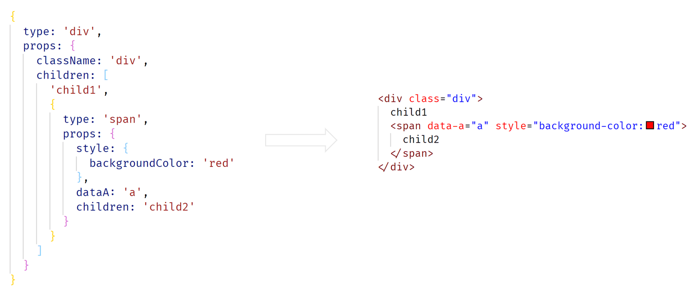

## 2.2	为什么需要虚拟dom

为什么需要虚拟`dom`？我们可以看一下尤雨溪在知乎的一个[回答](https://www.zhihu.com/question/31809713)，总结下来借助虚拟`dom`构建的项目的优点其实就只有一个：**"可维护性高"**。注意，这里的优点是不包括性能的，也就是说虚拟`dom`并不会带来性能上的提升。我们可以先看下最古老的前端项目是怎么实现页面交互的

先有一个初始的`dom`，通过接口获取初始数据，接着通过操作`dom`把数据渲染到页面上，以此类推

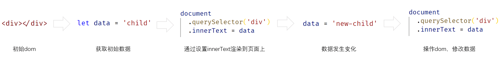

那么框架的意义在于，通过虚拟`dom`描述页面上的结构，开发者只需要修改变量数据，接下来的事情交给框架做就行，开发者不需要知道哪里需要发生变化。从以前的获取数据，修改数据，修改视图。变成了获取数据，修改数据。

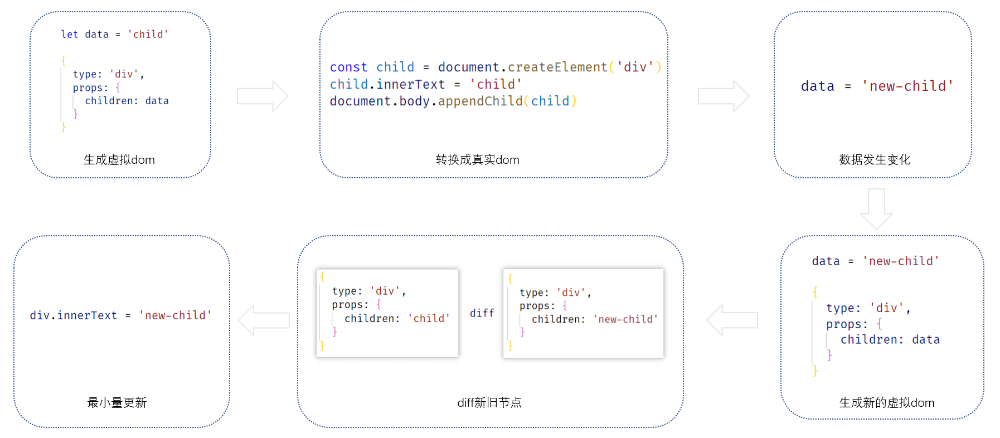

需要注意的是，框架的底层依然是操作`dom`，并且在修改数据和操作`dom`之前多了一层`diff`，`diff`并不是没有代价的，特别是在类`React`框架中，如果不借助`shouldComponentUpdate`或`memo`等方法，这个代价会变得非常的巨大，某些时候，可能还需要借助`immutableJs`或`immerJs`等库来减少 `shouldComponentUpdate`和`memo`比较的复杂度 。所以`React`的灵活也伴随着风险

## 2.3	虚拟dom属性说明

现在来了解一下虚拟`dom`的基本结构长什么样子，下面所展示的结构为了好理解为最**精简版本**（`props`甚至不支持`id`属性），为了方便理解

```ts
type ArrayType<T> = T | T[]

type LegalVNode = VNode | string | number | bigint | boolean | null | undefined

interface VNode {
  type: null | string | Function,
  props: Partial<{
    id: string
    style: Partial<CSSStyleDeclaration>,
    className: string,
    onClick: Function,
    onCaptureClick: Function,
    children: ArrayType<LegalVNode>
  }>,
  key: keyof any,
  _dom: HTMLElement,
  _parent: VNode,
  _component: any,
  constructor: null
}
```

这里面有几个属性特别重要，接下来会分别讲解

### 2.3.1	type

这个`type`是用来描述当前虚拟`dom`的类型，一般情况下，会遇到三类

- 元素节点，即`nodeType`为1的`dom`节点
- 文本节点，即`nodeType`为3的`dom`节点
- 函数组件/类组件

如果是元素组件的话，比如`div`，`p`，`span`等等，就会把这个标签的`tagName`保存在`type`上，比如

```js
{ type: 'div' }
```

如果是文本节点的话，为了和元素节点做区分，`type`存储一个`null`即可

```js
{ type: null }
```

如果是函数组件/类组件，`type`直接存储方法（类其实也是方法的一种）

```js
{ type: Component }
```

### 2.3.2	props

`props`这里用来存储当前节点绑定的属性，比如`className`，`style`和事件

需要注意的是，在虚拟`dom`中，还存在一个`children`，用来保存当前节点的子节点。如果当前节点只有一个子节点的话，那么`children`就是这个唯一子节点的值，如下

```js
{ props: { children: '1' } }
```

如果该节点存在多个值，那么此属性的值就是一个数组

```js
{ props: { children: [ '1', '2' ] } }
```

### 2.3.3	_children

通过上面对`props.children`的描述可知，这个属性的类型飘忽不定，一会是数组一会又不是，所以`Preact`会在虚拟`dom`上挂载一个`_children`，统一把子节点转化成一个数组。不仅如此，为了方便比较，`Preact`还会把 `string`，`number`，`bigint`类型转换成虚拟`dom`，比如

```js
{ type: 'div', props: { children: '1' } }
```

转换之后

```js
{ 
  type: 'div', 
  props: { children: '1' },
  _children: [
    { type: null, props: '1' }
  ]
}
```

### 2.3.4	constructor

之所以有这个属性是`Preact`做了一个小优化，它的值永远为`null`

比如在`React`中，渲染的节点必须是合法的虚拟`dom`节点，或者基础数据类型，如果瞎传便会报错

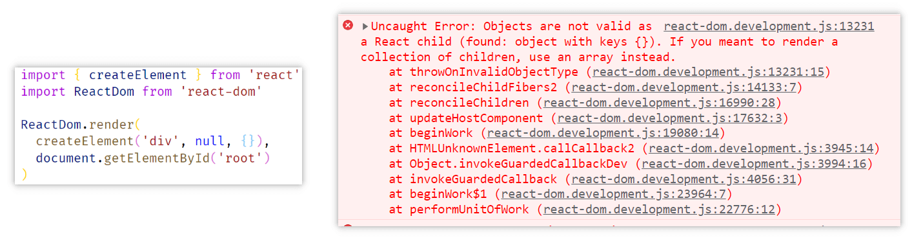

但是在`Preact`中不会这样，`Preact`中如果发现这个节点不是合法的节点，便不会渲染

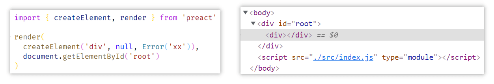

`Preact`是这么做的，因为在`js`中除了`null`和`undefined`之外的值，都是存在 `constructor`属性的，那么`Preact`如果发现当前的节点不是`null`或者`undefined`，那么只有两种合法可能

- 函数/类组件
- 元素/文本节点

那么文本节点在`2.3.3`说了，为了方便比较也会转换成虚拟`dom`，也就是说，当前节点的`constructor`如果能够取到值，那么肯定是开发者传进来了什么不好处理的值，直接`break`，不处理就行

### 2.3.5	其余属性

- **key：**  保存循环列表的时候给子元素赋值的`key`
- **_dom：** 保存当前虚拟`dom`对应的真实`dom`指向
- **_parent：** 保存当前虚拟`dom`的父虚拟`dom`节点
- **_component：** 如果是类组件的话，这个属性保存类组件的实例


## 2.4	创建虚拟dom

> 为了防止代码流水账，具体的代码实现已经放在[/packages/1](https://github.com/bpuns/Preact-study/tree/master/packages/1)，可自行查阅

### 2.4.1	jsx

平时编写的`React`项目，基本写的都是`jsx`，是如下所示

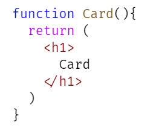

`jsx`并不是合法的`js`语法，想要在浏览器上使用的话，需要编译成`js`，比如借助`babel`来进行转化

### 2.4.2	Classic

我们可以打开`babel`的官网，点开这里的试一试

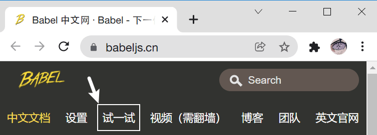

接着`preset`选择`react`，`react runtime`修改为`Classic`，在编辑器的左边输入源码，右边便会显示输出的合法的`js`代码

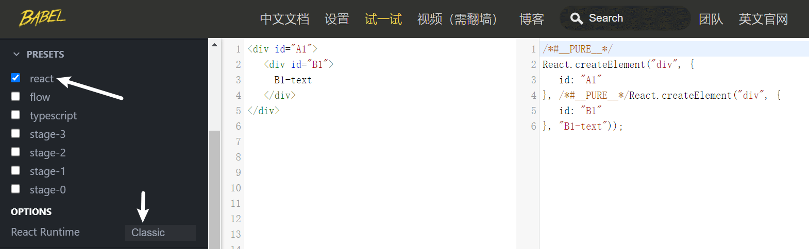

可以看到，`jsx`转化成了 `React.createElement` 方法，这就是`React`的一道经典面试题，为什么`jsx`中没有使用到`React`对象，却需要引入`React`

### 2.4.3	Automatic

在`React17`版本的时候，引入了“全新”的`jsx`转化方式，算是`React`在为`runtime`做了一点点优化，能够提升一点点运行时性能。把`React Runtime`修改为`Automatic`，可以看到，合法代码不再使用`React.createElement`方式创建，而是自动引入`jsx`函数，这样就不再需要手动引入`React`这个对象。除此之外，新的转化方式直接把`children`放置到第二个参数中，这样在运行时就不需再放置了，借此提升了一点性能

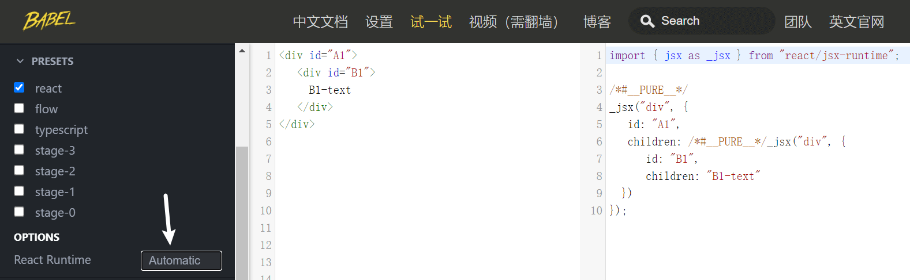


# 3	初识diff

## 3.1	了解diff算法

到现在为止，知道了如何创建虚拟`dom`，现在的目标是把这个`虚拟dom`树渲染到页面上，但是在具体的学习渲染之前，需要先了解`diff`算法的基本流程。当开发者调用`render`函数的时候，一般情况下，需要传递两个参数，第一个参数为初次渲染的虚拟`dom`，第二个参数为这个虚拟`dom`存放的容器

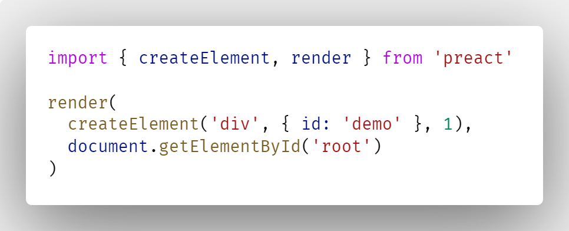

开发者可以重复调用`render`重新渲染，`render`内部会比较两个虚拟`dom`哪里发生了变化，然后做最小量更新。为了验证重新调用`render`之后页面上的`div`是否是重新生成的，可以做下面这个测试，在第一次渲染完成之后，获取页面中唯一的`div`对象，再次渲染之后，比较现在的`div`是否是同一个

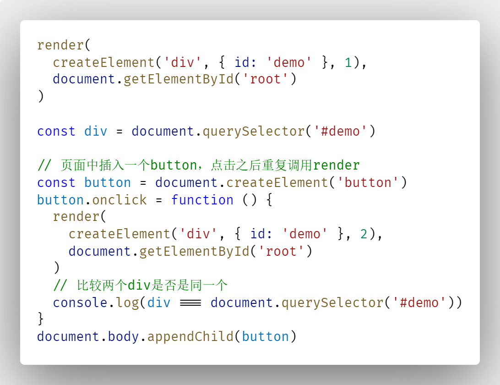

具体的代码实现我已经放在`git`仓库`packages/2`文件夹下。运行起来后点击`button`可以看到，控制台打印中，两个`div`对象确实是同一个

## 3.2	diff基本流程

那么现在就存在一个问题，就是第一次渲染的时候，并不存在旧的虚拟`dom`，那该如何比较？在`Preact`中，会把旧的虚拟`dom`存储在容器上，比如在上面的例子中，旧的虚拟`dom`就会存储在 `#root` 这个`dom`上，如果取不到，那么会准备一个空对象，与第一次传入的虚拟`dom`进行`diff`，`diff`完成之后，再把传入的虚拟`dom`赋值到`#root`上，这样下一次就能在`#root`上取到旧的虚拟`dom`了

从上面例子中，小伙伴可以看到，虚拟`dom`其实就是一颗树。那么我们就能通过遍历来处理这颗树。`diff`算法同理，在遍历的时候，只会对同一层的元素之间进行比较和复用，因为一般业务下，修改`dom`结构，都是发生在同层之间，跨层比较时间复杂度爆炸并且除了拖拽场景一般用不到

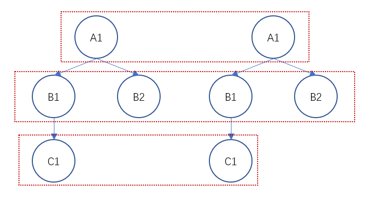

那么”同层比较“其实可以引导出两个逻辑，一个是在同层中寻找可以复用的节点，寻找完成之后，`diff`可以复用新旧节点的属性，处理完成之后，接着处理子节点，于是，就可以抽象出两个方法

- **diff：** `diff`可以复用的新旧节点（处理属性，事件绑定等）
- **diffChildren：** 
  - 比较旧节点的子节点和新节点的子节点，寻找可以复用的节点
  - 找到可以复用的新旧节点之后，传给`diff`函数
  - 判断子节点是否需要移动顺序（类似于排序）
  - 把没有使用到的旧节点全部从`dom`树上移除

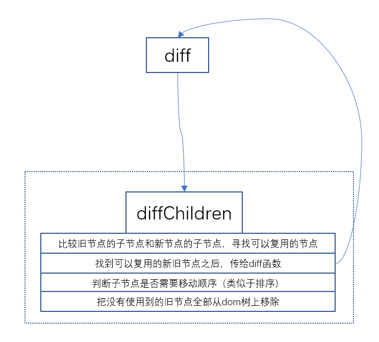


# 4	初次渲染

好了，铺垫已经完成，接下来学习的是怎么把虚拟`dom`渲染到页面上，为了简明扼要，接下来的都以最精简的实现为主，不考虑边缘情况

## 4.1	函数定义

如果只是想把虚拟`dom`渲染到页面上，其实准备三个函数就行，如下

- `render`：使用过`React`的开发者一定非常熟悉这个函数

```ts
/**
 * @param vnode      需要渲染到页面上的虚拟dom
 * @param parentDom  需要渲染的容器
 */
declare function render(vnode: VNode, parentDom: HTMLElement): void;
```

- `diffChildren`：在`3.2`小节说明了这个函数的作用，用来处理可复用的子节点

```ts
/**
 * @param parentDom       子节点要挂载到哪个dom下
 * @param newChildren     要处理的子节点
 * @param newParentVNode  新的父虚拟dom节点
 * @param oldParentVNode  旧的父虚拟dom节点
 */
declare function diffChildren(
  parentDom: HTMLElement,
  newChildren: Array<LegalVNode>,
  newParentVNode: VNode,
  oldParentVNode: VNode
): void;
```

- `diff`：对比两个可复用虚拟`dom`节点，修改属性

```ts
/**
 * @param parentDom     当前节点需要挂在到哪个dom下
 * @param newVNode      新虚拟dom节点
 * @param oldVNode      可复用的虚拟dom节点
 */
declare function diff(
  parentDom: HTMLElement,
  newVNode: VNode,
  oldVNode: VNode
): void;
```

## 4.1	render

> 具体代码实现见 [/render.js](https://github.com/bpuns/Preact-study/blob/master/packages/3/src/react/render.js)

接下来，准备一个虚拟`dom`，这个虚拟`dom`可以说把“大部分”情况全部覆盖了，首先，存在`children`为数组或单节点的情况，其次`props`中存在基本属性，`style`和事件绑定处理

```js
const style = { border: '3px solid #D6D6D6', margin: '5px' }

const element = (
  createElement(
    'div', { className: 'A1', style },
    'A-text',
    createElement(
      'div', { className: 'B1', style },
      'B1-text',
      createElement('div', { className: 'C1', style, onClick: () => alert(1) }, 'C1-text'),
      createElement('div', { className: 'C2', style }, 'C2-text')
    ),
    createElement('div', { className: 'B2', style }, 'B2-text')
  )
)
```

目前的`render`函数只需要考虑三件事情

- 取到旧的虚拟`dom`节点，取不到用空对象代替
- 存储新的虚拟dom节点，方便之后使用
- 调用`diffChildren`

## 4.2	递归逻辑

### 4.2.1	diffChildren

>  具体代码实现见 [/children.js](https://github.com/bpuns/Preact-study/blob/master/packages/3/src/react/diff/children.js)

现在`render`方法把要处理的子节点传递给了 `diffChildren`，还记得虚拟`dom`上的 `_children`属性吗，用于保存方便处理的子节点，所以需要遍历新节点，处理`null`，`undefined`，`string`，`number`，`bigint` 类型，以下就是初次渲染的逻辑如下

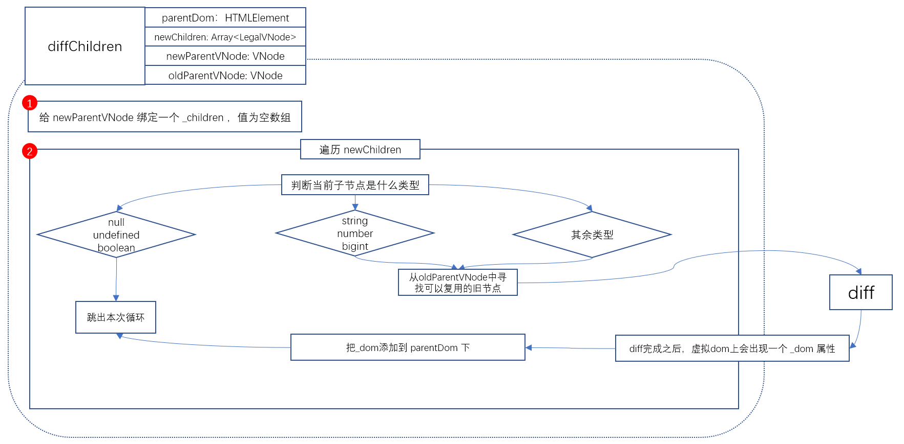

因为目前是初次渲染，所以把`从oldParentVNode中寻找可以复用的旧节点`的逻辑给删除了

### 4.2.2	diff

初次渲染的`diff`的逻辑相对简单，因为没有旧节点，所以只需要判断当前是元素节点还是文本节点，调用对应的创建`dom`的`api`，把创建好的元素挂载到虚拟`dom`的 `_dom` 上就行。为什么方便查看是否挂载正确，可以先把`className`属性挂载到`dom`上

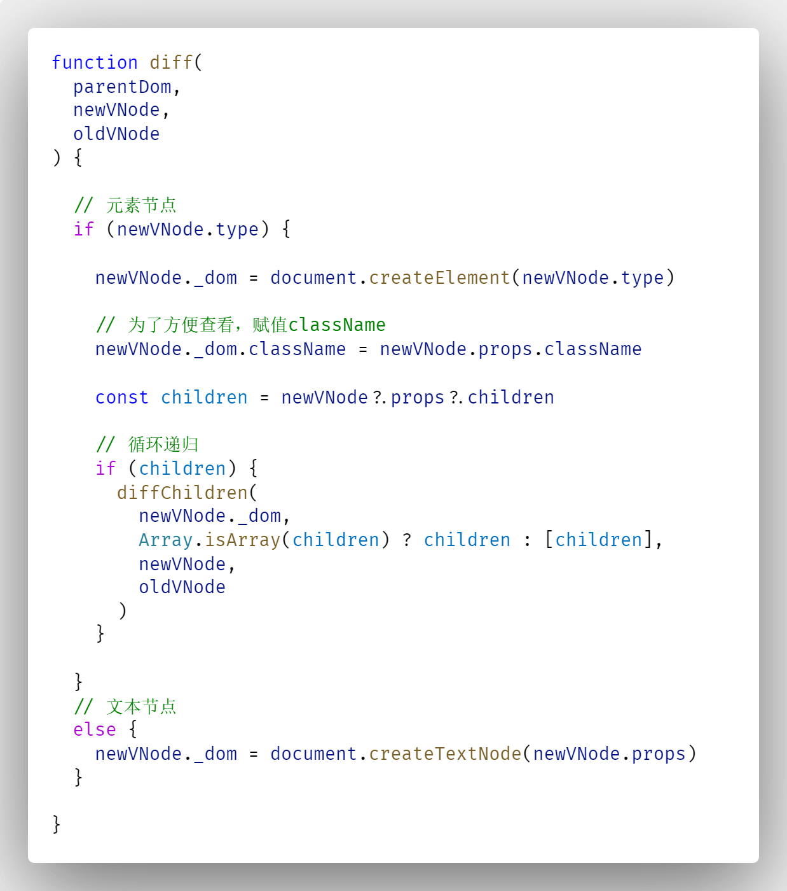

到现在为止，基本的`dom`结构已经完整的渲染到页面上，具体的`demo`放置在 `packages/3` 下

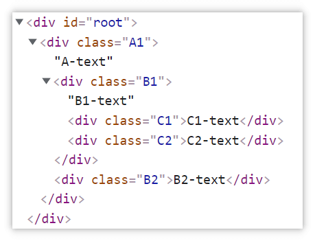

## 4.3	props处理

> 具体代码实现见 [/props.js](https://github.com/bpuns/Preact-study/blob/master/packages/4/src/react/diff/props.js)。
>
> `props`的处理可以单独提取出来一个方法单独处理，类型定义如下

```ts
/**
 * @param dom       当前虚拟dom对应的真实dom节点
 * @param newProps  新虚拟dom节点的props属性
 * @param oldProps  旧虚拟dom节点的props属性
 */
declare function diffProps(
  dom: HTMLElement,
  newProps: Pick<VNode, 'props'>,
  oldProps: Pick<VNode, 'props'>
): void;
```

在`diffProps`中需要做两件事情

- 把`oldProps`中存在，`newProps`中不存在的属性给移除掉
- 分发属性给不同的函数进行单独处理（这里只处理三个类型：`style`，`事件绑定`，`其它属性`）

基本流程图如下

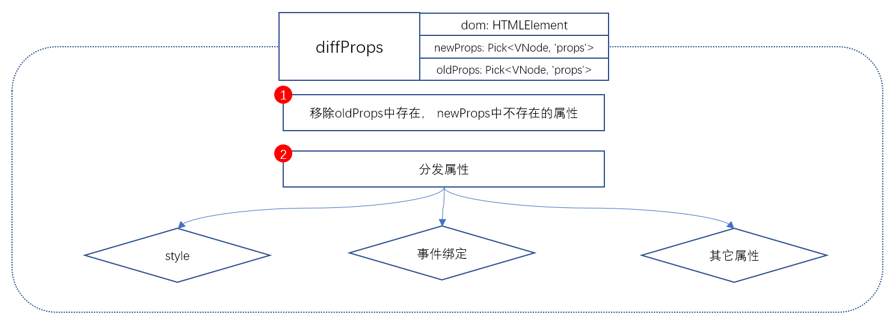


### 4.3.1	style

`React`的`style`需要写成对象的形式，`css`属性使用驼峰命名法，如下

```js
{
  backgroundColor: 'red',
  borderBottomColor: 'green',
  ...
}
```

但是，并不能进行简单的拼接直接赋值到`cssText`上，因为驼峰命名法在`html`中是不合法的，我们需要转化成“中划线法”

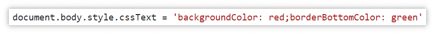

这就需要对`key`进行转化，我们可以借助`String`原型上的`replace`方法，`replace`有一个函数重载，第一个参数可以传递一个正则，第二个参数传递一个方法，接收的参数就是正则调用 `exec`返回的值，函数的返回值为替换值，使用如下

```js
'borderBottomColor'.replace(/[A-Z]/g, s => `-${s.toLocaleLowerCase()}`)  // 'border-bottom-color'
```

那么接下来只需要做一个循环，把每个属性和值拼接在一起就可以了

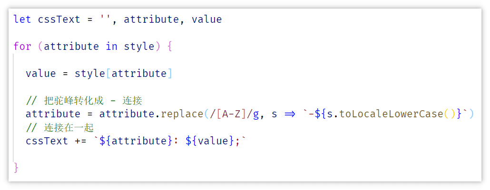

注意，这里没有处理`size`相关属性自动加上`px`的逻辑，感兴趣的小伙伴可以自己想想

### 4.3.2	事件绑定

`Preact`的事件绑定与`React`不同，`React`自己实现了一套事件委托机制，把所有的事件全部绑定到同一个根节点上，通过自己实现一套事件捕获与冒泡机制实现事件绑定。这里主要学习一下`Preact`是如何实现事件绑定机制的。在`js`中，事件绑定分为两种，一种是捕获阶段，一种是冒泡阶段，在虚拟dom中，通过不同的命名方式进行区分捕获与冒泡，命名方式如下

- **onCatureClick：** 事件捕获阶段触发
- **onClick：** 事件冒泡阶段触发

所以在`Preact`中事件绑定的时候，需要先判断一下当前绑定的事件是冒泡还是捕获，紧接着，`Preact`会给每个需要绑定事件的`dom`对象上添加一个 `_listeners`空对象，用来保存给这个`dom`绑定的全部事件。这里是事件名称没有什么要求，只要能有效区分触发各个事件的方法就行

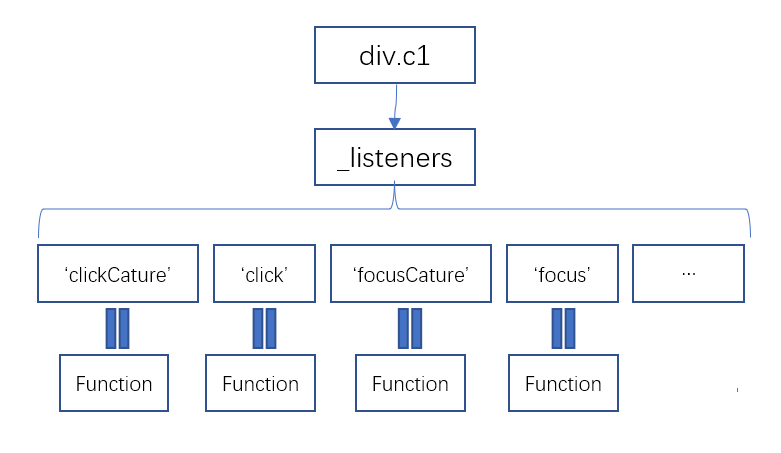

接着，准备两个代理方法，这两个方法在整个页面运行周期内只存在一份，所有事件触发全部经过这两个代理方法

```js
function eventProxy(e) {
  this._listeners[e.type](e)
}

function eventProxyCapture(e) {
  this._listeners[e.type + 'Capture'](e)
}
```

最后一步，进行一个逻辑判断。之所以这么做，其实是因为平常的业务中，会频繁的触发`domDiff`，如果每次`diff`都需要重新解绑后再重新绑定，明显太浪费性能了，所以所有事件只绑定一次，把需要触发的对象保存在 `_listeners` 上，当`domDiff`函数发生变化的时候，只需要替换`_listeners`中的方法就行，修改一个对象的值的代价永远比解除绑定重新再绑定的代价小的多

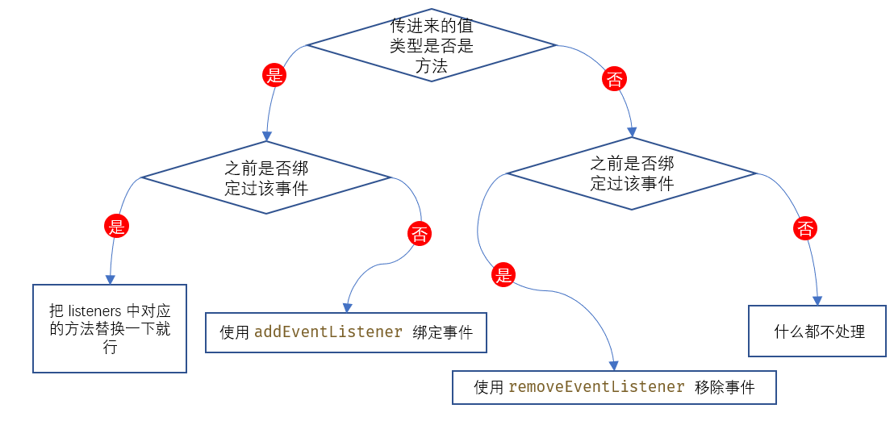

### 4.3.3	其它属性

剩余的属性可以使用下面的逻辑进行设置

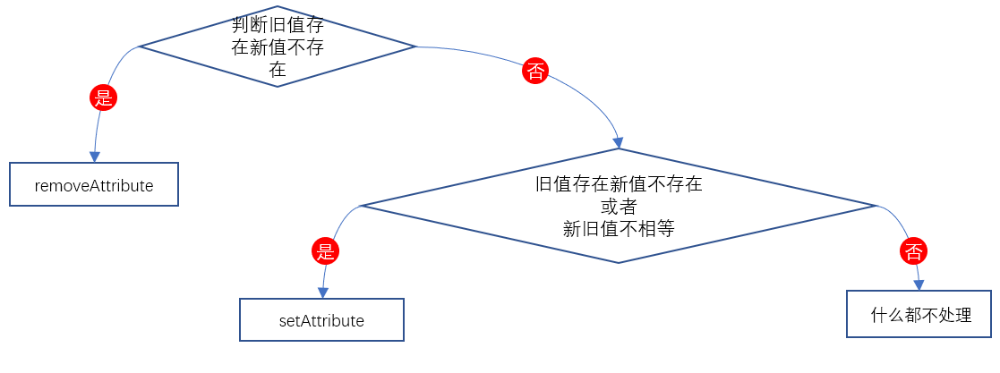

# 5	节点复用

> 节点复用整体逻辑见 [/packages/5](https://github.com/bpuns/Preact-study/blob/master/packages/5)，可以使用 `$ npm run 5` 启动

接下来就是`diff`算法的核心，如何从旧节点中寻找可以复用的节点，`diff`完成之后如何排列`dom`的位置。接下来就简述一下`Preact`的`diff`算法是如何实现的，需要注意的是，为了方便理解，以下的`diff`算法简略了一些小细节

## 5.1	key的作用

有这么一道面试题：《为什么要在循环列表中使用`key`，并不推荐`index`用作`key`》，你可以在网上找到长篇大论来解答这个问题，其实只需要一句话就可以解答这个问题。在`React`中，新旧节点使用`type`和`key`是否一致来判断是否可以复用。如果使用`index`来作为`key`的话，就会出现错误复用的问题

比如下面的`oldChildren`中，每个`li`节点的子孙节点不同，在`setState`之后，只是把列表的顺序打乱，并没有修改子孙节点，但是在`React`中，他只知道，`li.1` 的 `type` 为 `li`，`key`为`0`，`li2`的 `type` 为 `li`，`key`为`0`，它就会认为这两个是同一个节点，并且子孙节点个数不同。以此类推，就会把简单的顺序调换，变成了，移除子孙节点，创建新节点的复杂操作，浪费了多余的性能

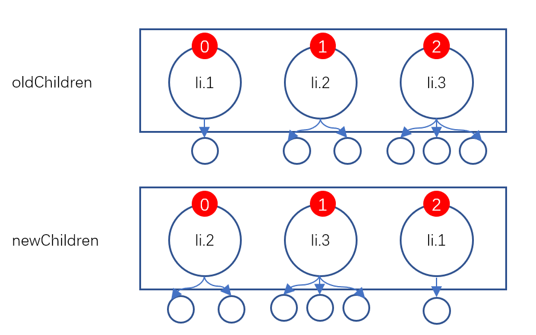

## 5.2	寻找可复用的节点

`diff`算法的逻辑必须从实际情况出发，在项目中，大多数出现的情况并不是移动的`dom`的位置，而是如下情况

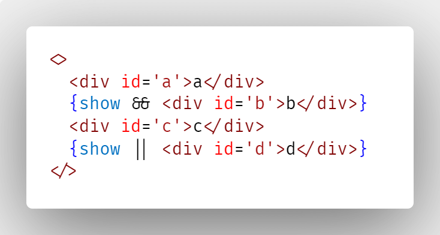

所以当`show`为`boolean`类型的时候，子节点会存在以下两种情况

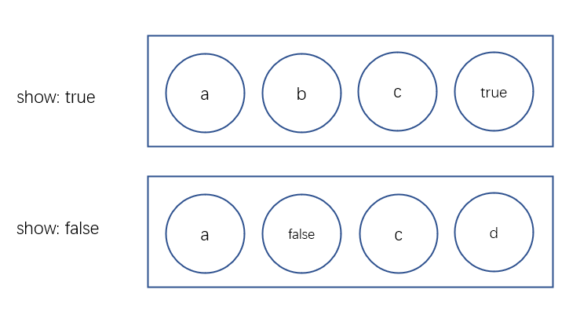

在 [4.2.1 节](###4.2.1	diffChildren)中已经说明了子节点的渲染逻辑，就是遍历子节点，那么遍历自然就能拿到当前数组的索引值，在`Preact`中，会直接拿当前子节点的索引去旧的子节点数组中取相同位置的。比如a，c节点，新旧数组索引都是0，那么就可以直接命中

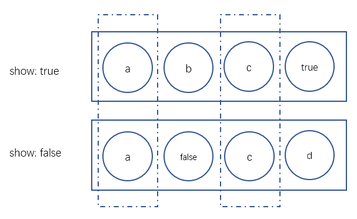

如果没有命中，`Preact`就会使用傻办法，直接从`0`开始遍历，时间复杂度为`O(n)`。如果命中，**把`oldChildren`中对应索引的虚拟`dom`设置为`null`**，这是为了移除没有使用到的节点而准备

正是因为这个优化机制，所以千万不要写成下面这种格式，不然无法正确的复用

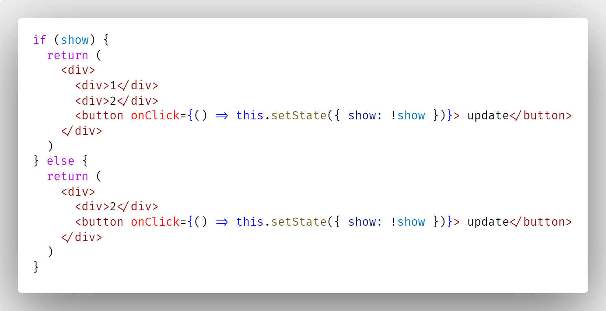

## 5.3	diff

这节的`diff`方法是在`diffChildren`中的`for`循环中执行的（和初次渲染一致）。在上一小节中已经找到了可以复用的节点了，那么接下来的操作就是把新节点与可复用节点传递到 `diff` 方法中

既然是复用节点，就不能像 [4.2.2 小节](###4.2.2	diff) 那样简单粗暴直接创建节点了，具体逻辑如下

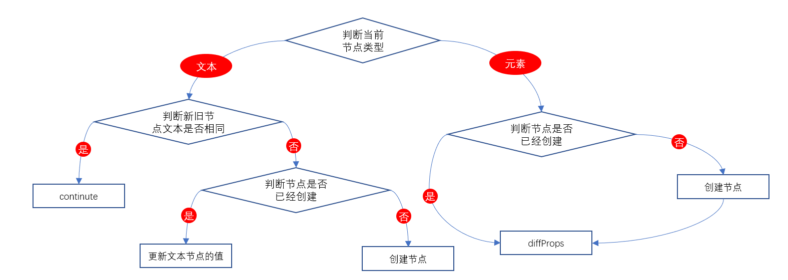


## 5.4	移动节点位置

### 5.4.1	理论

> **循环外变量：**

在`for`循环`newChildren`之前，需要准备一个变量 `oldDom`，可以把它看成一个指针，指向目前列表中的第一个真实`dom`对象。比如，当前页面上是[`#a`,`#b`,`#c`,`#d`]，那么`oldDom`指向的就是`#a`，如果取不到，赋值一个`null`即可

> **循环中变量：**

在每次的`for`循环中，准备如下3个变量

- **childVNode：**当前要处理的新子节点
- **oldVNode：**在旧的虚拟dom中找到可以复用的旧的虚拟dom节点，取不到，这个值为`null`或`undefined`
- **newDom：**当前要处理节点的真实`dom`对象（`diff`函数执行完成后，挂载在`childVNode._dom`属性上）

---

接着，判断`childVNode`是否是`oldDom`的虚拟`dom`，只需要做如下两个判断，如果全是`true`，说明是同一个节点

- `oldVNode`是否存在，如果不存在说明在`oldChildren`中不存在可复用的节点
- `oldDom`与`newDom`是否是同一个

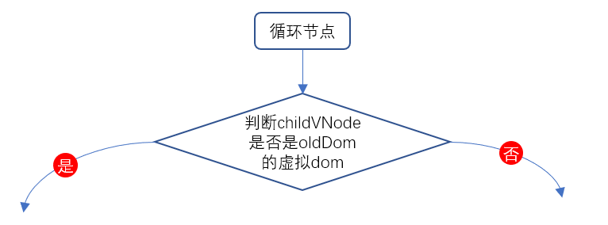

如果是同一个节点的话，就不需要处理，继续循环下一个要处理的新节点，把`oldDom`修改成新节点的弟弟节点

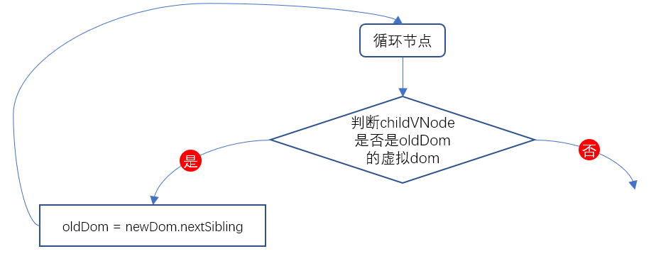

如果不是同一个节点，判断`oldDom`是否存在，如果不存在，直接把`newDom`添加到父`dom`的尾部，接着进入下一次循环

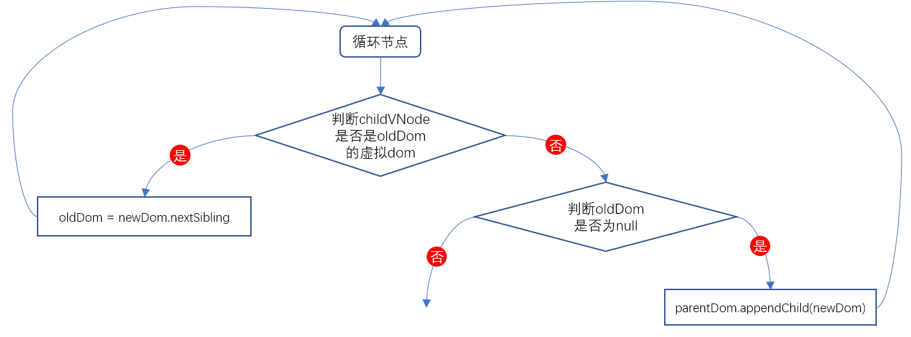

如果`oldDom`存在，判断`newDom`是否在`oldDom`的后面，如果在后面，什么都不做，如果在前面，插入到`oldDom`前面，接着，进入下一个新的子节点的循环

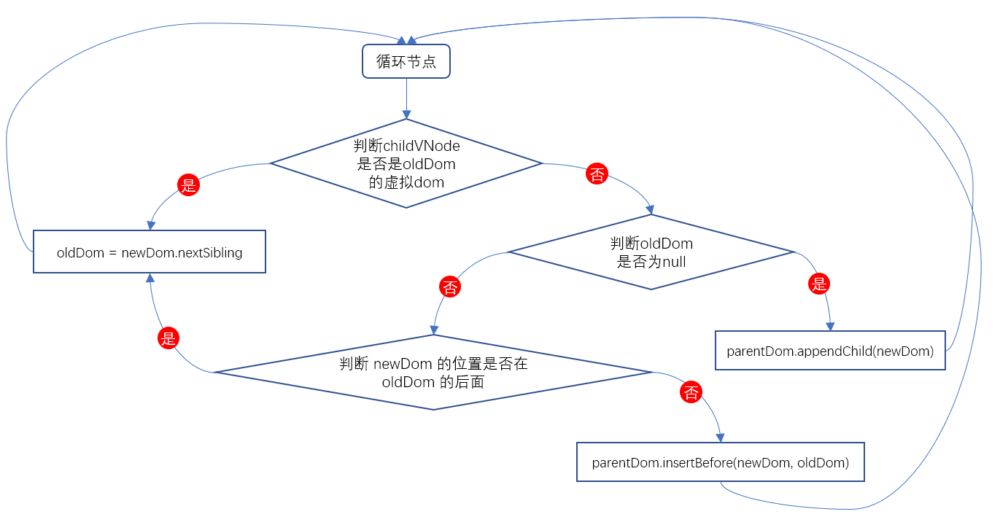

### 5.4.2	实践

比如，现在页面上的元素为

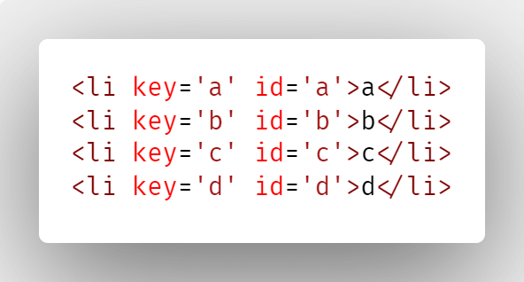

`update`之后为

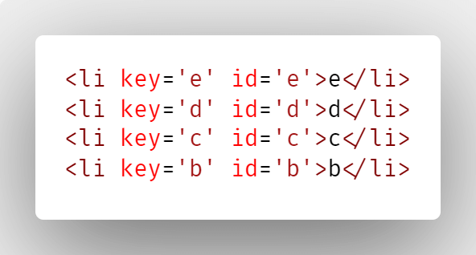

在循环前，取一个 `oldDom`，现在的`oldDom`值为`li#a`

#### 处理e

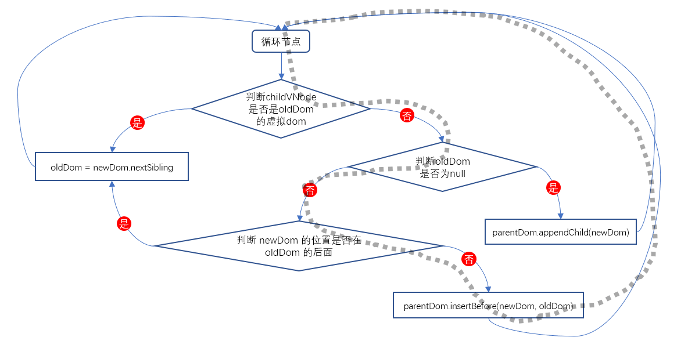

页面上的`dom`就会变成下面这样

```
[ #e, #a, #b, #c, #d ]
```

#### 处理d

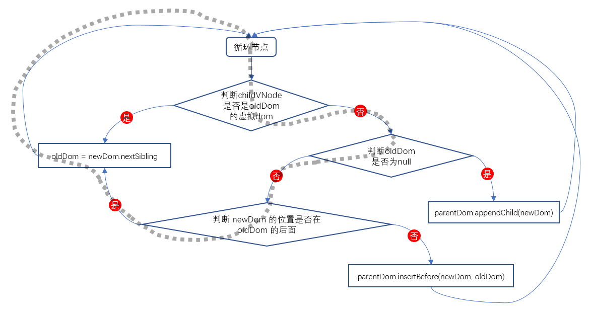

页面上的`dom`就会变成下面这样，`oldDom`变成了 `null`

```
[ #e, #a, #b, #c, #d ]
```

#### 处理c

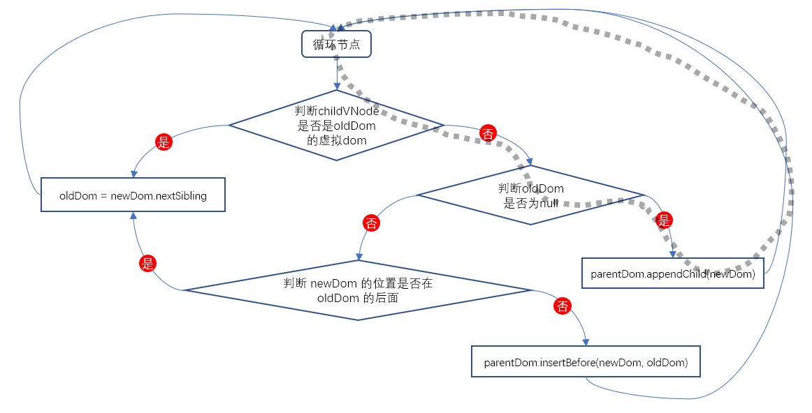

页面上的`dom`就会变成下面这样

```
[ #e, #a, #b, #d, #c ]
```

#### 处理b


页面上的`dom`就会变成下面这样

```
[ #e, #a, #d, #c, #b ]
```


## 5.5	移除无效节点

在[5.2小节](##5.2	寻找可复用的节点)中提到这么一句话： **命中后，把`oldChildren`中对应索引的虚拟`dom`设置为`null`**，我们还用上面的例子，现在`oldChildren`如下

```js
[ 
	{ type: 'li', { key: 'a', id: 'a' }, 'a' }, 
	null, 
	null, 
	null, 
	null
]
```

我们只需要把不为`null`的元素从页面中删除，那么整个`diff`算法就可以结束了，删除后，此时页面中的`dom`如下

```
[ #e, #d, #c, #b ]
```


# 	6	组件渲染

> 组件渲染的逻辑见 [/packages/6](https://github.com/bpuns/Preact-study/blob/master/packages/6)，可以使用 `$ npm run 6` 启动

## 6.1	Component

想要实现类组件，就需要创建一个`Component`类，由类组件继承。这个类上有`setState`，`forceUpdate`等方法，目前先不实现。因为类其实可以看成方法的语法糖，所以我们没办法在代码中判断是类还是方法，所以需要在类上绑定一个静态属性，用来标识这是一个类组件

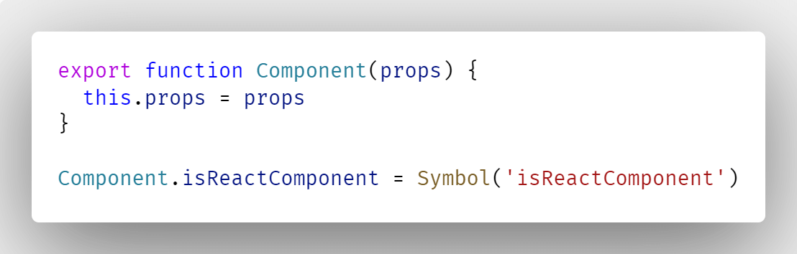

这样，只需要在`diff`方法中进行如下判断就可以判断当前是什么组件

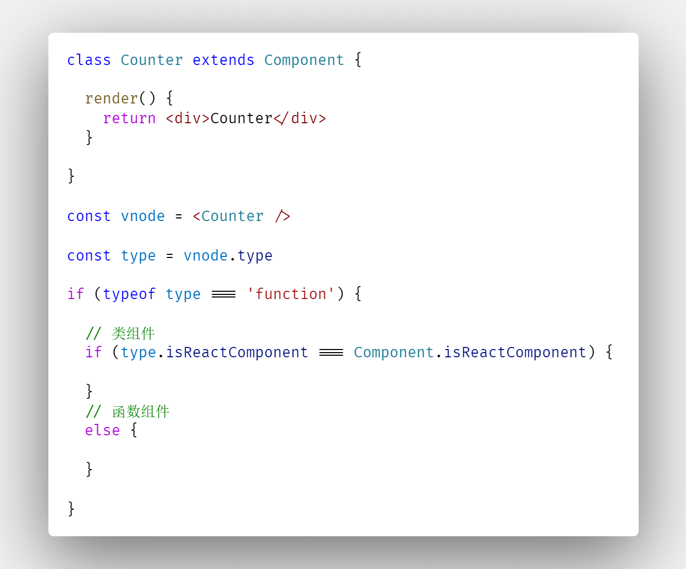

## 6.2	函数组件

在`Preact`中，函数组件的处理方式和类组件一致。比如说，如果是类组件的话，在框架内部肯定需要实例化它，那么函数是如何实例化的？我们可以看下面类组件与函数组件的比较

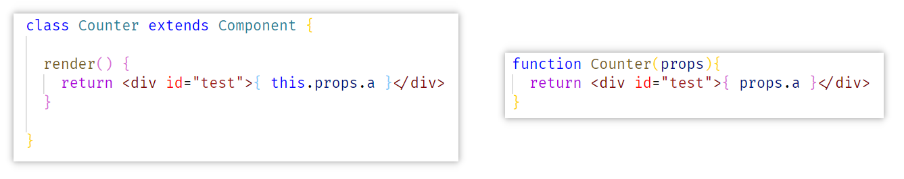

可以很明显的看到，函数组件其实就是类组件的`render`方法，所以`Preact`中，如果判断当前组件是函数组件，它也会实例化，但是实例化的不是函数组件，而是`Component`，然后把实例化后的`Component`对象，添加一个`render`属性，这个`render`属性的值自然就是这个这个函数组件

所以，在`Preact`的类组件的`render`方法比`React`多了一个功能，能直接接收`props`，不需要从`context`上获取`props`，因为这是顺便的事情

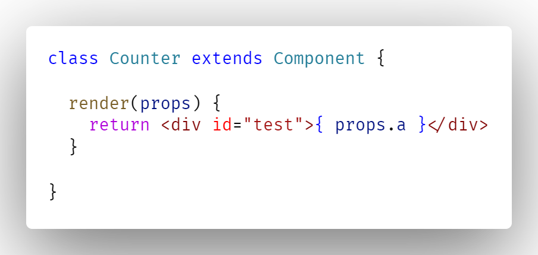

## 6.3	类/函数组件渲染

现在先不考虑套娃情况，所谓的套娃最常见的就是高阶组件，一个类组件或函数组件中`return`出来的根节点也是一个类组件或函数组件，现在只考虑一种情况，就是`return`出来的就是一个元素节点或文本节点。那么这种情况下，处理起来是最简单的

首先，先修改`diff`函数中的分支语句，因为之前只处理过原生节点，现在要加一个分支，直接判断`type`是不是函数类型

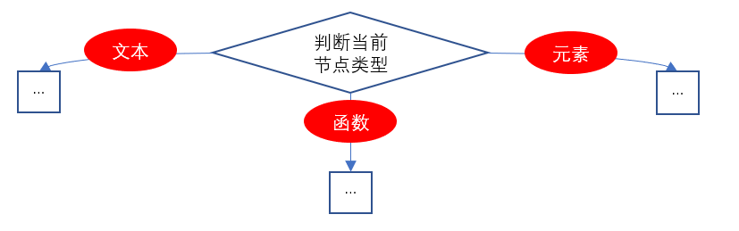

还记得虚拟`dom`上存在一个`_component`的属性吗，用来保存是否已经实例化过该组件了，所以如果之前已经实例化了，就没必要再实例化一次，直接复用之前的对象，反之亦然。这里不要忘记了一件事情，就是函数组件使用`Component`作为替身，然后重写`Component`的`render`方法

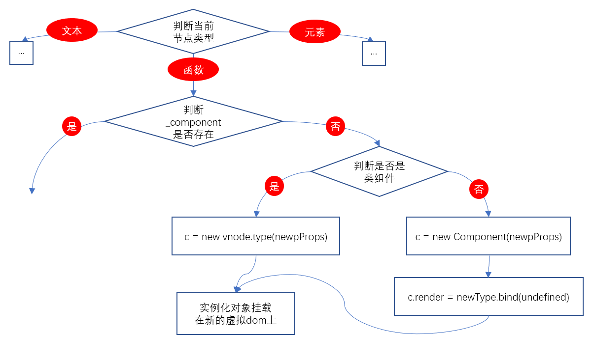

最后，只需要执行`render`，获取返回的虚拟`dom`，与旧的节点的子节点，一起传进`diffChildren`中，`diff`函数的任务就结束了

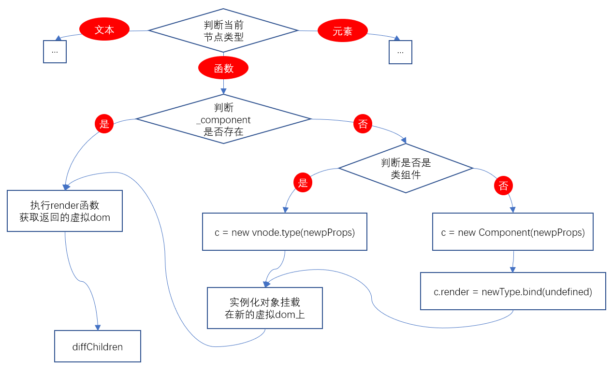

但是，还没有结束，需要对`diffChildren`做一点处理


## 6.4	diffChildren

看下下面这个例子，当左边的虚拟`dom` `update` 到右边的虚拟`dom`后，会发现`d`和`e`没有被移除掉

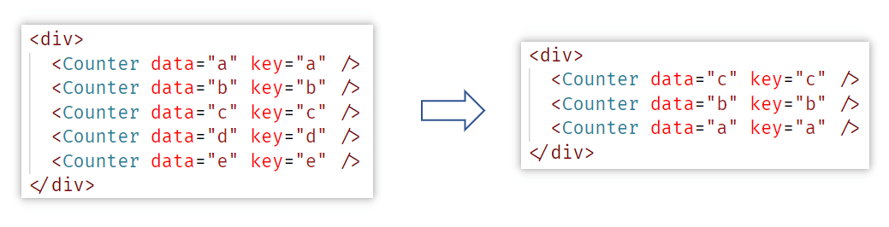

这是因为函数组件并不能转化成真实的`dom`，真正显示在页面上的是`render`中的内容，这就导致了函数组件的虚拟`dom`上`_dom`属性为空。为了解决这问题，可以借助`diff`算法的特性，就是深度优先的递归策略。这意味着，子节点永远比父节点先完成`diff`，而且可以在`diffChildren`中，获取子节点的真实`dom`的指向，我们直接把它赋值到父虚拟`dom`的`_dom`属性上

```js
newParentVNode._dom = childDom
```

这是因为子节点比父节点先完成，如果父节点是一个真实`dom`的话，`_dom`会重新赋值，如果不是，其`_dom`就会指向`render`中返回的第一个真实的`dom`，这样在移除`dom`的时候，就不会出现函数组件无法移除的问题

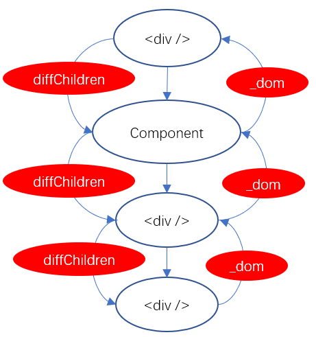

但是这还没有结束，因为在`React16`中新增了 `Fragment`组件，这意味着`render`可能并不会返回唯一的一个根节点


# 7	Fragment

> `Fragment`相关实现见 [/packages/7](https://github.com/bpuns/Preact-study/blob/master/packages/7)，可以使用 `$ npm run 7` 启动

## 7.1	Fragment实现

`Fragment`其实很简单，就是一个函数组件，内部把`children`返回出来

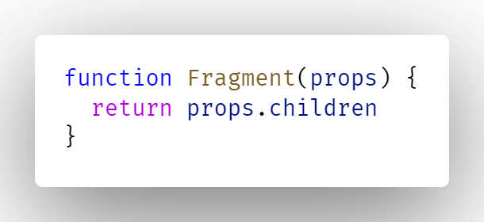

## 7.2	diff算法出现的问题

使用`Fragment`之后，意味着一个类/函数组件并不会返回唯一的一个节点，如何还按照之前的方式渲染，势必会出现问题，比如下面的例子

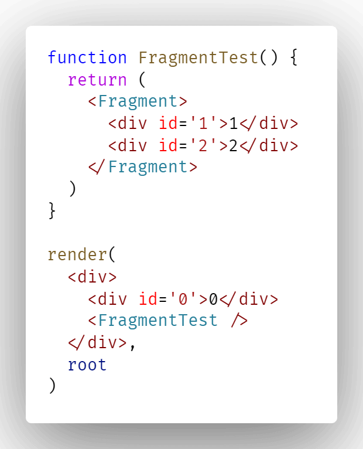

在页面中就会渲染成下面这样

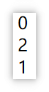

之所以会这样其实很好理解，可以重新看一下[6.4节](##6.4	diffChildren)的挂载逻辑，函数组件的`_dom`属性会指向`render`中返回的第一个真实的`dom`，那么意味着，当前虚拟`dom`树如下。因为`Fragment`和`FragmentTest`都是函数，所以`div#1`这个节点会被挂载到`Fragment`和 `FragmentTest` 节点上，记住这一点

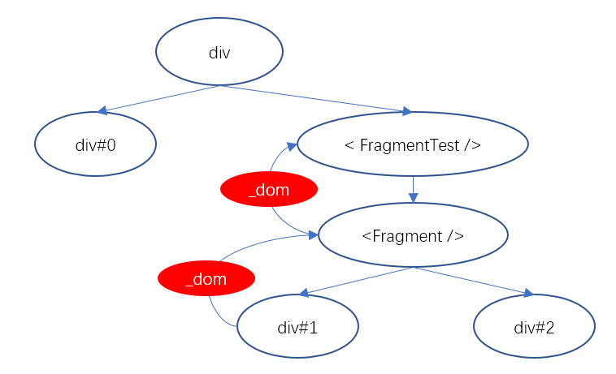

由于`Fragment`和`FragmentTest`都是函数组件，并不会真实映射到`dom`树上，所以这会发生什么事情呢？首先，由于递归深度优先的策略，算法中，会先把 `div#0` 插入到父节点上，接着处理 `FragmentTest`的子节点`Fragment`的子节点，就是`div#1`和`div#2`插入到父节点上，处理顺序如下

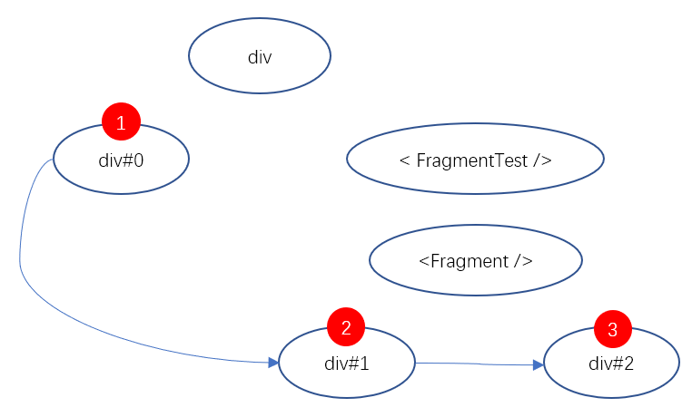

这时候，内存中排序是正确的

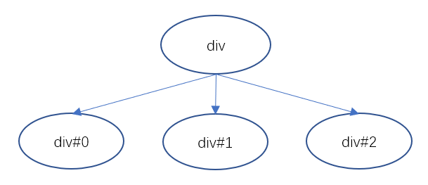

但是，好玩的事情就来了，因为所有的叶子节点全部处理完成了，所以接下来就会向上处理，自然就是`Fragment`节点，因为存在子节点`dom`挂载到父节点的操作，那么就会发生`Fragment`的`_dom`也会挂载到`dom`树下的操作，但是因为`dom`不能重复挂载到同一个`dom`树下，所以就会发生`dom`节点的移动

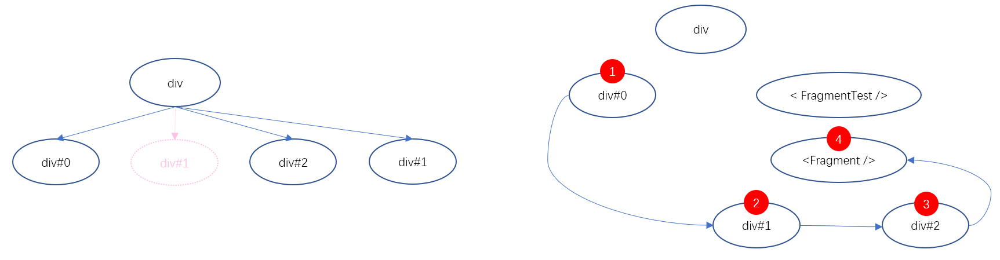

同理，接着往上处理父节点，就会重复处理父节点的操作...

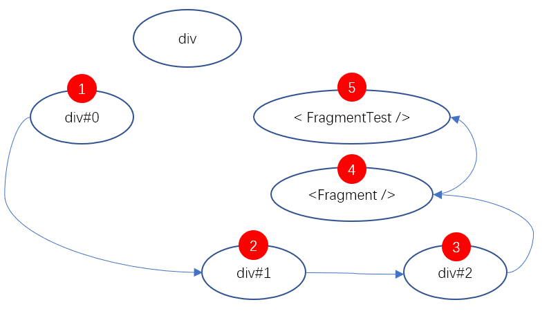

## 7.3	修改diff算法

那么，为了解决这个问题，其实也很简单，还是利用 “递归深度优先的策略” 和“函数组件不会渲染到页面上”这两个规则来解决这个问题

因为不管层级有多深，它都会先处理叶子节点 ，而且，同一层`dom`的`parentDom`都是同一个，那么意味着，`diffChildren`中处理函数组件的时候，子节点自己就已经排好序了，不需要函数组件自己再排序了

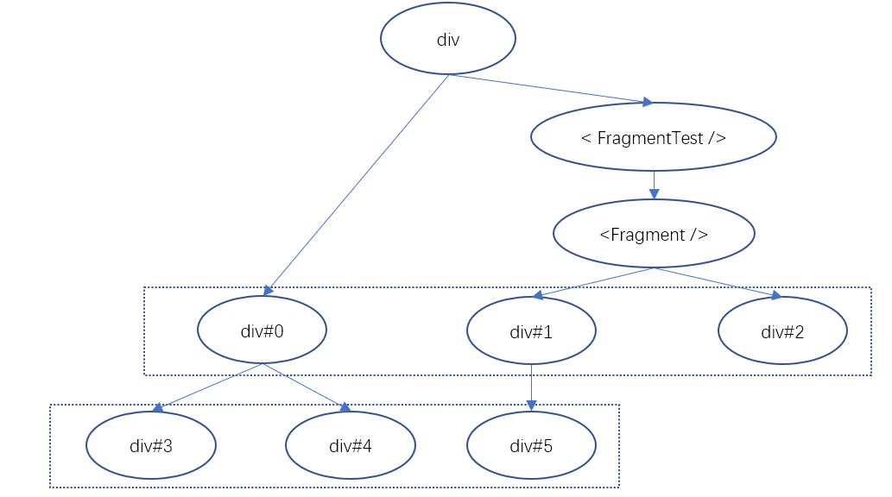

也就是说，判断当前是虚拟`dom`是函数组件的话，就不需要进行 [5.4](##5.4	移动节点位置) 那般操作了，直接`return`就好了

## 7.4	列表中的Fragment

在`Preact`中有个小细节需要处理，平时业务编写中，经常出现的就是列表的渲染

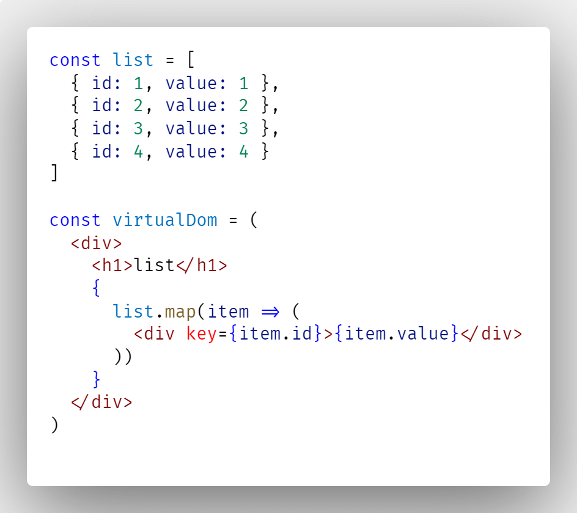

虚拟`dom`的`props`结构描述如下

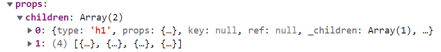

`Preact`中，如果当前某一个子节点是数组的话，那么就会包一层`Fragment`

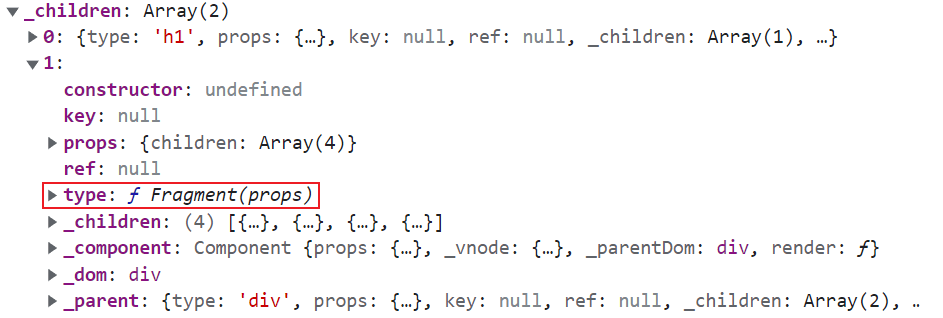


# 8	初次渲染的生命周期

> `初次渲染的生命周期`的相关实现见 [/packages/8](https://github.com/bpuns/Preact-study/blob/master/packages/8)，可以使用 `$ npm run 8` 启动

这里就不实现 `UNSAFE` 的生命周期和错误处理相关的生命周期了，那么初次渲染会触发的生命周期函数其实只有两个，一个是静态方法 `getDerivedStateFromProps`，一个是`componentDidMount`

## 8.1	static getDerivedStateFromProps

我从网上找了一个张图

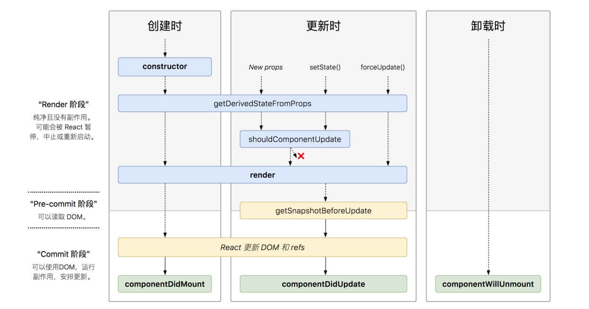

可以看到 `getDerivedStateFromProps`它会在初始化和数据更新的时候执行，那么代码中，就不需要判断执行时机，每次`diff`都触发，类型定义如下，传入两个参数，`nextProps`就是新的虚拟`dom`的`props`，`prevState`就是当前组件中的`state`的值

```ts
type GetDerivedStateFromProps<P, S> = (nextProps: Readonly<P>, prevState: S) => Partial<S> | null;
```

具体的代码实现也非常的简单，需要先准备一个 `_nextState` 的变量，用来存储下一次的`state`，之所以这么做，是因为在之后的生命周期实现中，需要接收新旧`state`，所以不能相互覆盖了

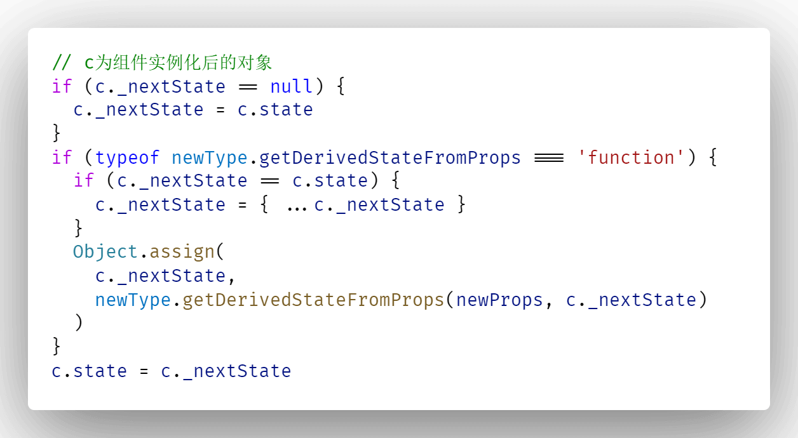

## 8.2	componentDidMount

`componentDidMount`需要在所有节点渲染完成之后才会执行，好在`render`方法是同步的，也就是说可以在`diff`方法执行之前，存储一个任务队列，这个任务队列在`diff`全程存在，`diif`完成之后，把任务队列中的所有待执行方法全部执行，就完成了

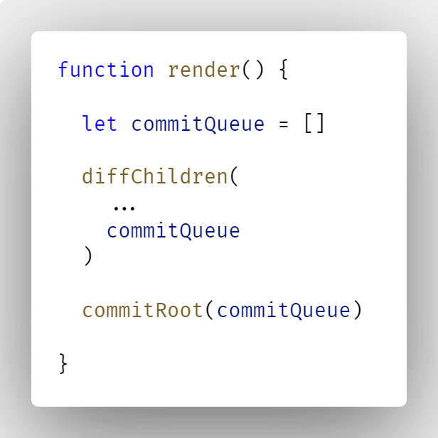

因为一个类组件中，可能存在多个需要处理完成后触发的函数，比如之后要说的`setState`回调， `componentDidUpdate`等，所以，我们可以在每个组件的实例上，也保存一个队列，需要执行回调的话，直接这个类的实例存储在`commitQueue`中，这样的好处是，如果只存储了一个方法的话，那么这个方法的上下文就没法确定了

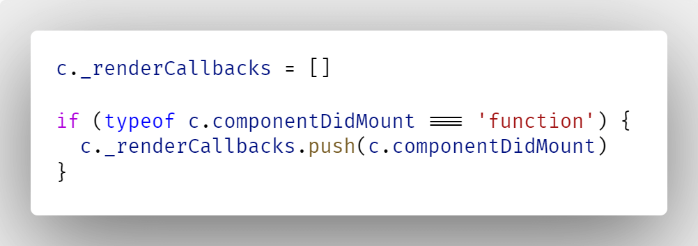

`commitRoot`相关逻辑如下

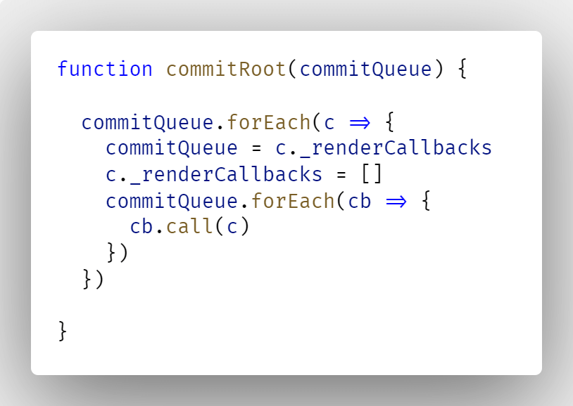

# 	9	setState

> `setState`的相关实现见 [/packages/9](https://github.com/bpuns/Preact-study/blob/master/packages/9)，可以使用 `$ npm run 9` 启动

## 9.1	React17的setState

背过`React`面试题的小伙伴一定知道下面这道题目，点击按钮之后，控制台会打印多少次`render`，点击完成之后，页面上的`count`会变成多少

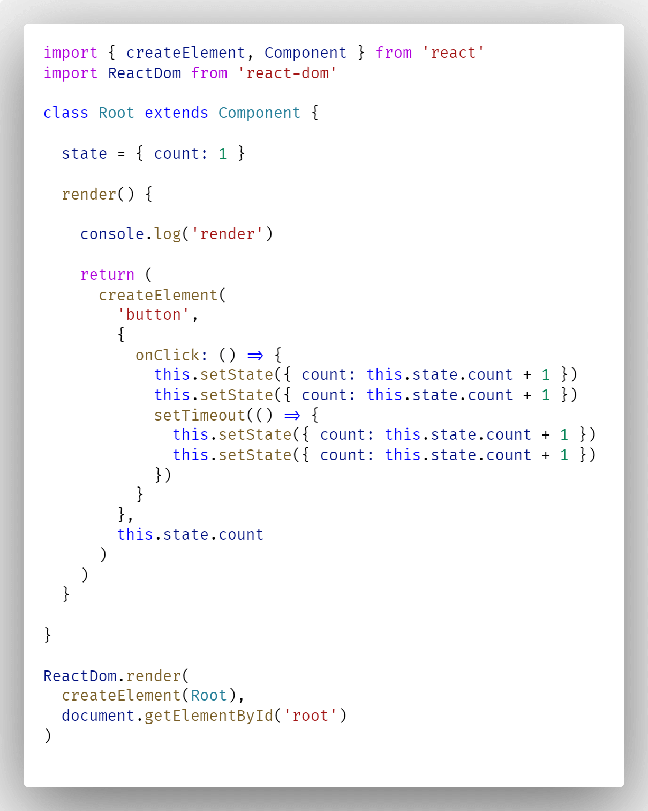

答案是3次，页面上的`count`变成了4，因为前两次的`setState`进行了合并，`setTimeout`因为已经脱离了目前的执行栈，`React`合并更新的机制失效了

所以`React`在17版本中在`React-Dom`中提供了 `unstable_batchedUpdates` 方法，能够让我们手动合并更新，使用如下

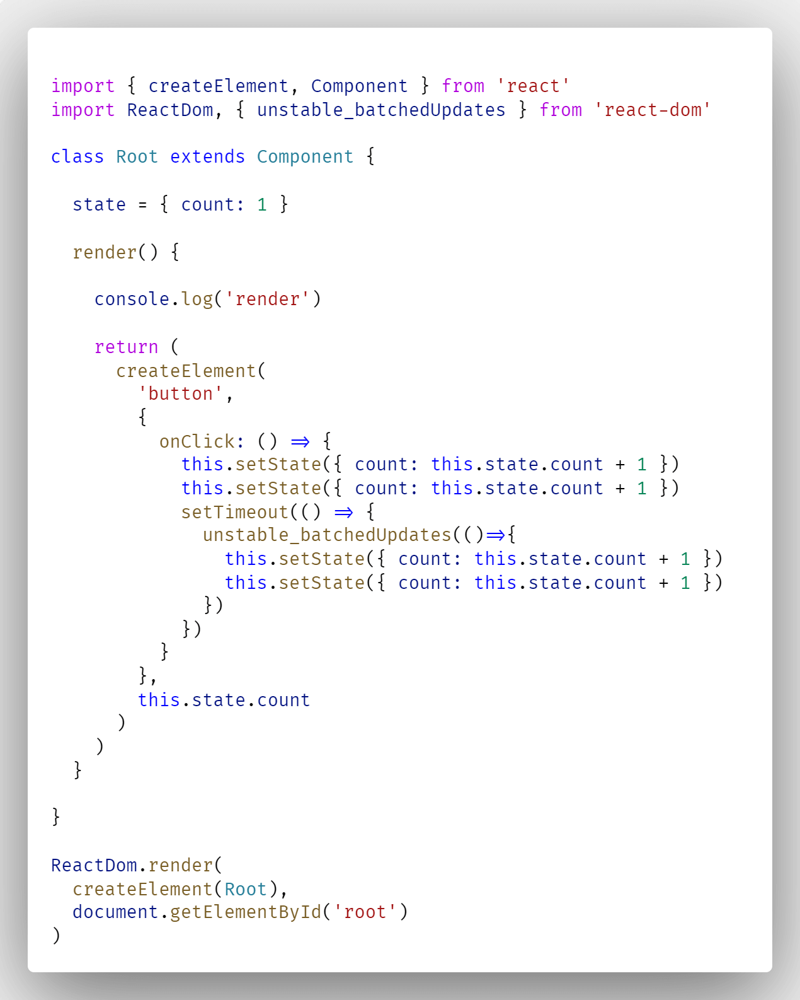

现在点击`button`之后，页面上只会打印两次`render`

## 9.2	React18的setState

更新到18版本之后，使用`createRoot().render()`创建的`ReactApp`就不需要开发者操心合并更新的事情了

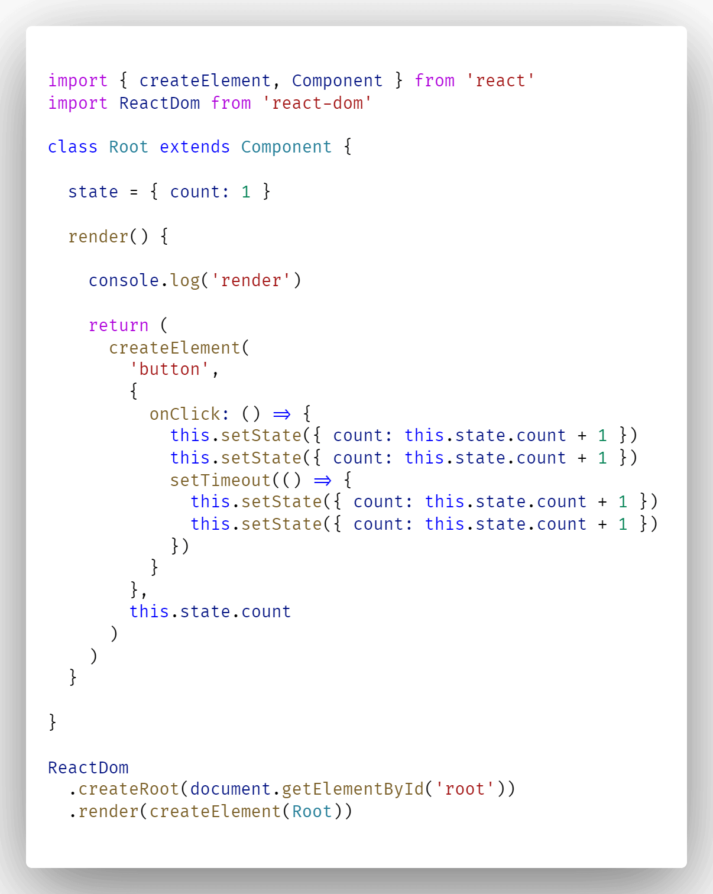

但是使用`render`方式创建`ReactApp`表现与`React17`一致（觉得`React`屎山味越来越重了）


## 	9.3	借助任务队列实现合并更新

接下来，介绍`Preact`是如何实现合并更新的。使用过`js`的开发者一定都知道`JavaScript`的一个特点就是单线程。那么单线程就会涉及到一个事件循环机制，说到事件循环，又不得不引出`js`的宏任务队列与微任务队列概念。下面这类型的面试题各位小伙伴一定都做过

```js
console.log(1)

setTimeout(() => {
  console.log(2)
})

new Promise((resolve) => {
  console.log(3)
  resolve()
}).then(() => {
  console.log(4)
  setTimeout(() => {
    console.log(5)
  })
})

queueMicrotask(() => {
  console.log(6)
})

setTimeout(() => {
  console.log(7)
})
```

答案是1，3，4，6，2，7，5

那么我们就能借助微/宏事件队列这个模型来实现一个合并更新，以下为核心代码实现，这里的`isDirty`变量至关重要，用来标注一个组件是否是脏组件，避免重复`push`到微任务队列中

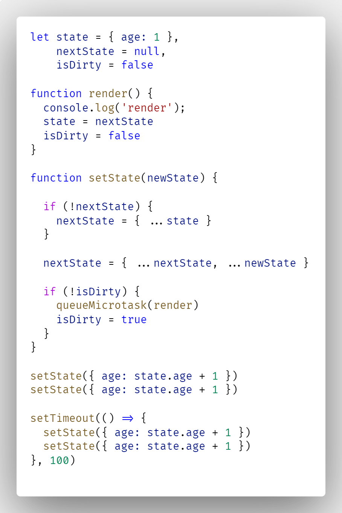

## 	9.4	setState

`setState`的类型定义如下，`S`为`state`的类型，`P`为`props`的类型，可以看到，`setState`第一个参数可以传递两种类型，第二个参数可以传递一个`callback`，这很好实现，直接放到 `_renderCallbacks`任务队列中就行，执行它的任务之后会交给`commitRoot`完成，`setState`不需要关心此事

```ts
setState<K extends keyof S>(
	state:
		| ((
				prevState: Readonly<S>,
				props: Readonly<P>
			) => Pick<S, K> | Partial<S> | null)
		| (Pick<S, K> | Partial<S> | null),
	callback?: () => void
): void;
```

具体的实现逻辑如下

1. 在 `Component`类上准备一个`setState`的方法，此方法接收两个参数。还记得在 `static getDerivedStateFromProps`中准备的 `_nextState`变量吗，我们只需要把第一个参数处理完成的结果，保存在 `_nextState`中，那么在`diff`方法中，就能自动帮助我们处理

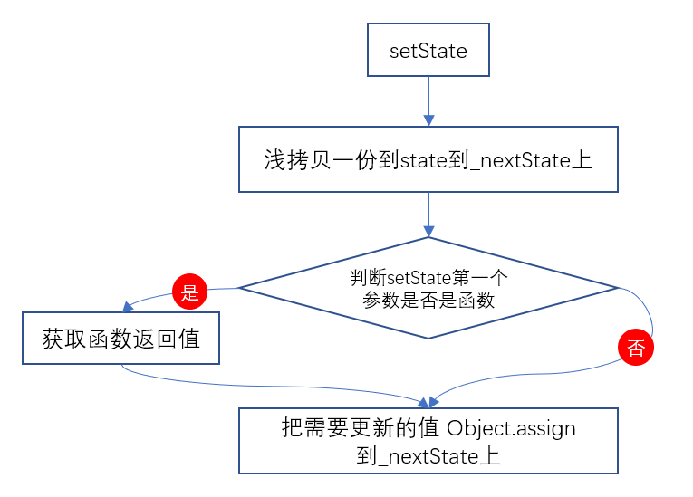

2. 判断第二个参数是否是个方法，如果是方法，直接放到 `_renderCallbacks` 中

3. **全局**准备一个更新队列 `rerenderQueue`，因为可能多个类组件需要更新，再准备一个 `enqueueRender` 方法，用来接收需要更新的类组件的实例，把组件实例存储到 `rerenderQueue` 中，并在这个方法中借助微任务队列实现合并更新的操作

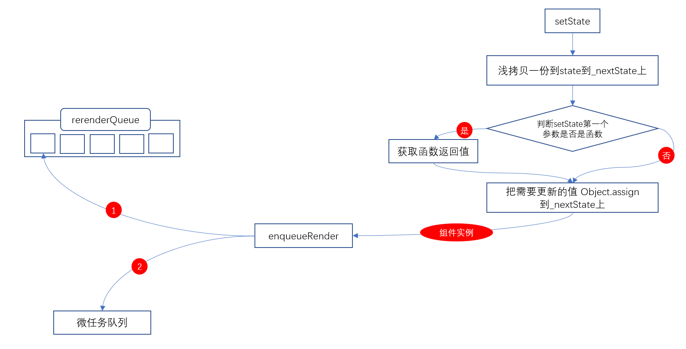

4. 当上面的工作全部处理完成之后，事件循环机制就会开始处理微任务队列中的任务，`rerenderQueue`中保存了需要更新的类组件实例，接下来要干的事情其实和 `render` 方法要干的事情是一样的，有一点区别，就是不再从根节点开始`diff`，因为`React`是单向流，直接从需要`update`的节点向下`diff`整课树就行

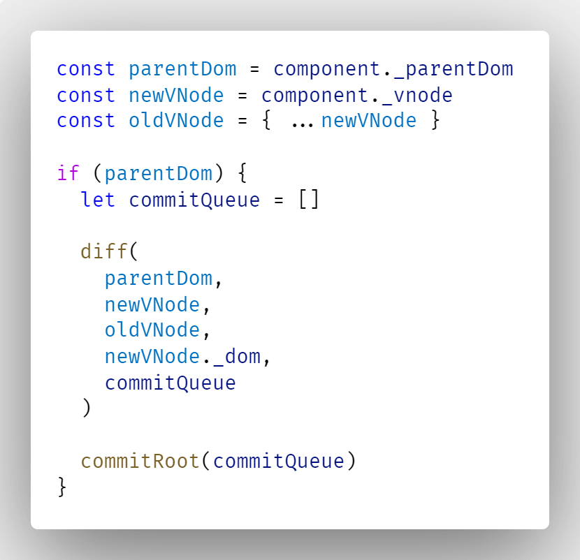


## 9.5	forceUpdate

`forceUpdate`的内部实现与`setState`一致，只不过没有第一步的处理逻辑。并且调用它之后，不会触发`shouldComponentUpdate`方法，直接调用`render`获取新的虚拟`dom`，紧接着直接进入`diff`阶段。为了实现这个效果，可以在类组件实例上准备一个变量`_force`，标识为`true`，到时候执行 `shouldComponentUpdate` 前，如果变量是否为`true`，就不执行`shouldComponentUpdate`方法


# 		10	update生命周期实现

> `update`的相关实现见 [/packages/10](https://github.com/bpuns/Preact-study/blob/master/packages/10)，可以使用 `$ npm run 10` 启动

## 10.1	shouldComponentUpdate

`shouldComponentUpdate`类型定义如下

```ts
shouldComponentUpdate?(
  // 下一次的nextProps
  nextProps: Readonly<P>,
  // 下一次的nextState
  nextState: Readonly<S>,
  // 先不考虑context
  nextContext: any
): boolean;
```

因为`shouldComponentUpdate`不是静态方法，所以在此方法中，可以访问到未更新前的`state`和`props`。所以需要传入下一次的`props`和`state`，这其实也非常好实现，`nextProps`从新的虚拟`dom`上取，`nextState`已经挂载到`_nextState`上，大概逻辑如下

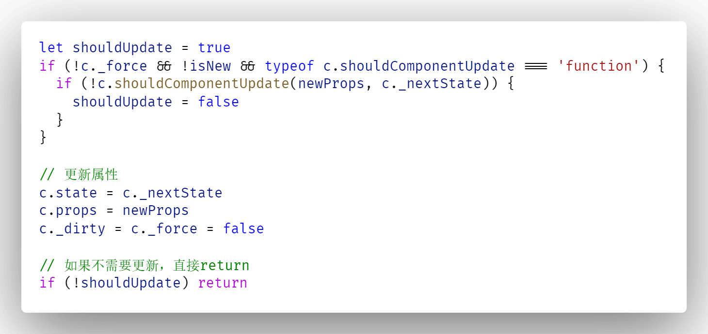

## 10.2	getSnapshotBeforeUpdate/componentDidUpdate

`getSnapshotBeforeUpdate`需要和`componentDidUpdate`合起来一起看，首先，先看一下两者的类型定义

```ts
getSnapshotBeforeUpdate?(prevProps: Readonly<P>, prevState: Readonly<S>): SS | null;
componentDidUpdate?(prevProps: Readonly<P>, prevState: Readonly<S>, snapshot?: SS): void;
```

需要注意的是，`getSnapshotBeforeUpdate`会在`update`前触发，也就是说可以在这个函数中进行一些`dom`状态的保存，但是此时，组件实例中的`state`和`props`已经被覆盖，所以此生命周期接收的参数是上一次的`props`和`state`。并且`getSnapshotBeforeUpdate`的返回值会当作`componentDidUpdate`的第三个参数传入

了解了需要传递的参数，那么实现也相当容易

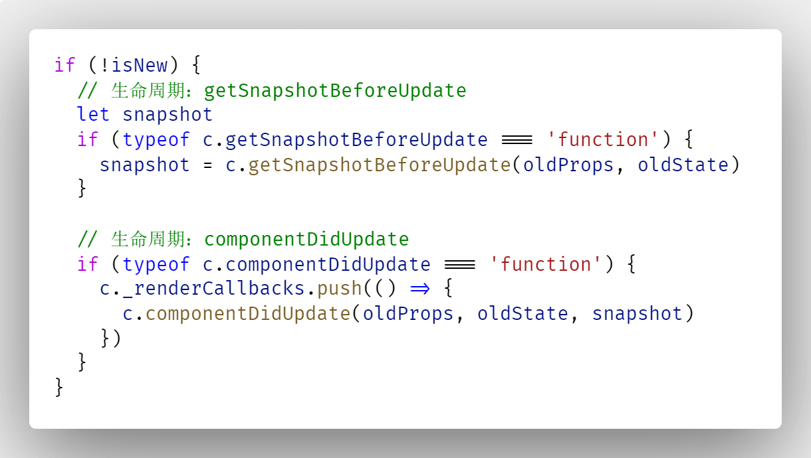


# 	11	组件卸载

> `unmount`的相关实现见 [/packages/11](https://github.com/bpuns/Preact-study/blob/master/packages/11)，可以使用 `$ npm run 11` 启动

组件卸载的时候，会触发 `componentWillUnmount`方法，但是在之前的`diff`算法讲解中，移除未使用的组件只是简单的把`dom`元素移除掉。因为浏览器会帮助我们把一个节点下的所有子节点全部移除。那么要实现`componentWillUnmount`，只需要做一个递归

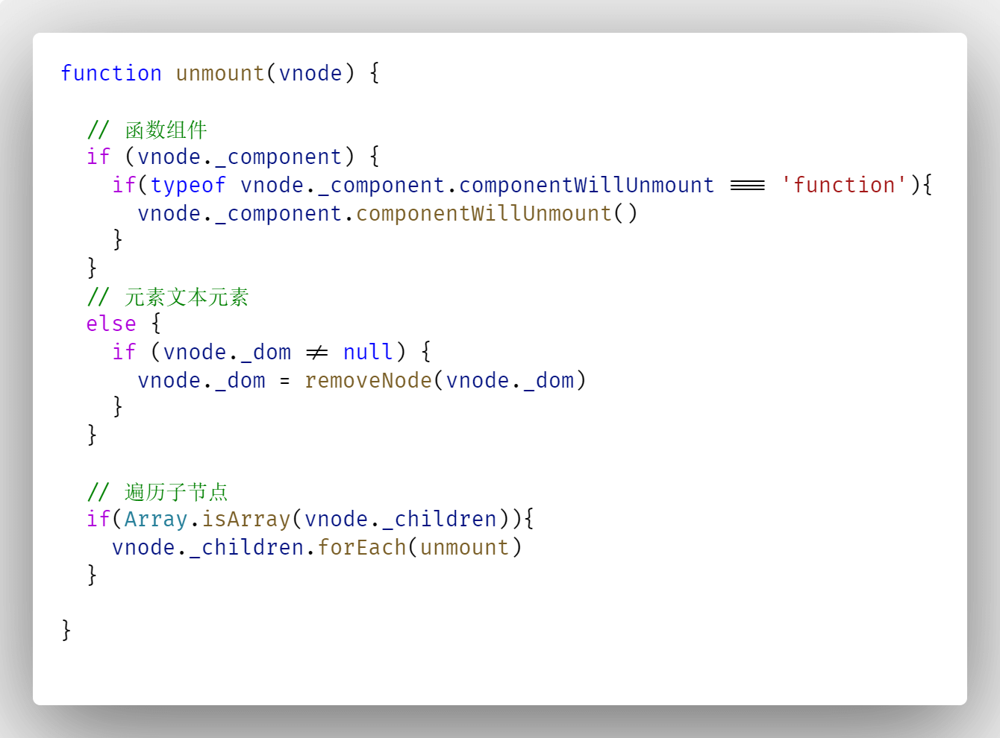


# 		12	Context

> `Context`的相关实现见 [/packages/12](https://github.com/bpuns/Preact-study/blob/master/packages/12)，可以使用 `$ npm run 12` 启动

## 12.1	rerenderQueue与_dirty

在讲解`Context`之前，回顾一下在`setState`中说过的 `rerenderQueue`在`Context`中的应用，看下面的例子，现在虚拟`dom`树结构下。`A1`向下提供内容，`B2`和`C2`都使用到了它

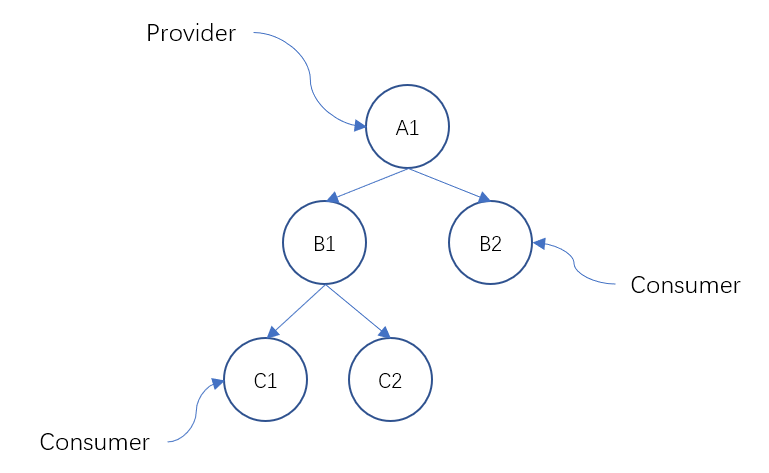

当`A1`的内容发生改变之后，`Preact`会在需要更新的组件上添加一个标识 `_dirty`，并赋值为`true`。并把`A1`，`B2`，`C1`全部推到 `rerenderQueue` 中，从队列中索引为0的位置开始遍历，每个节点向下递归更新，所以需要判断一下当前更新队列中的组件实例`_dirty`是否为`true`，因为如果不为`true`，说明已经处理过了，不需要更新

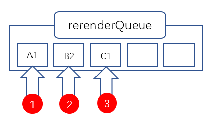

当更新操作完成之后，`Preact`会把节点的 `_dirty`赋值为`false`，所以其实在`diff` `A1`的时候，已经顺便把`B2`和`C1`处理过了，因此队列中的第二和第三并不会处理

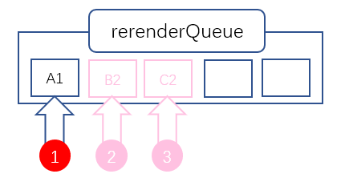

那`rerenderQueue`如果不设置为一个数组，此时，`B1`添加一个`shouldComponentUpdate`生命周期，直接阻止更新，`A1`的`Provider`发生改变，从`A1`开始向下递归更新，那么`C1`的消费行为在整个页面的生命周期中就是无效行为

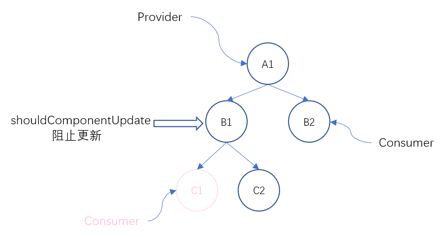

那么存成数组的好处就出现了，直接遍历`rerenderQueue`处理其中的每一个节点，因为`A1`向下递归更新，`B2`顺带处理完成，`C1`由于父节点阻止更新导致未处理，但是此时`C1`存在`rerenderQueue`中，遍历完`A1`和`B2`，自然就会处理到它

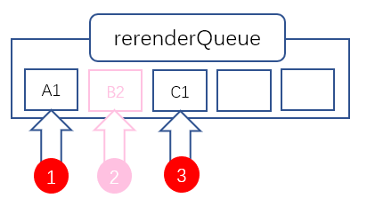

## 12.2	createContext

### 12.2.1	globalContext和contextId

看下图例子，有没有想过这么一个问题，`A1`和`B1`分别提供了`Provider`，为什么`B2`只能消费`ctx1`，`C1`却能消费`ctx1`和`2`


`Preact`中是这么实现的，首先，`Provider`其实就是一个函数，那么意味着，处理方式与`Fragment`类似，也会借助`Component`进行实例化

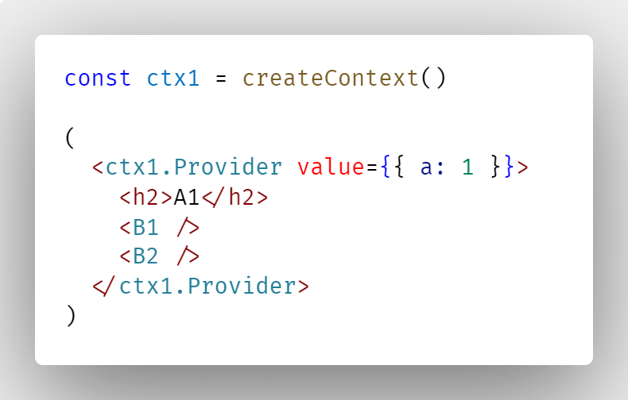

每次执行`createContext`的时候，内部都会为每个`context`生成一个唯一的`id`，这个`id`名为`contextId`，比如现在创建两个`context`，假设两者的`id`分别为`ctx1`，和`ctx2`

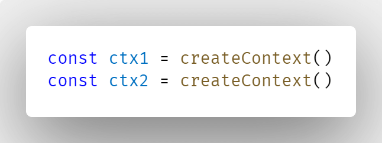

在`diff`的入口，`Preact`会准备一个空对象，名为`globalContext`

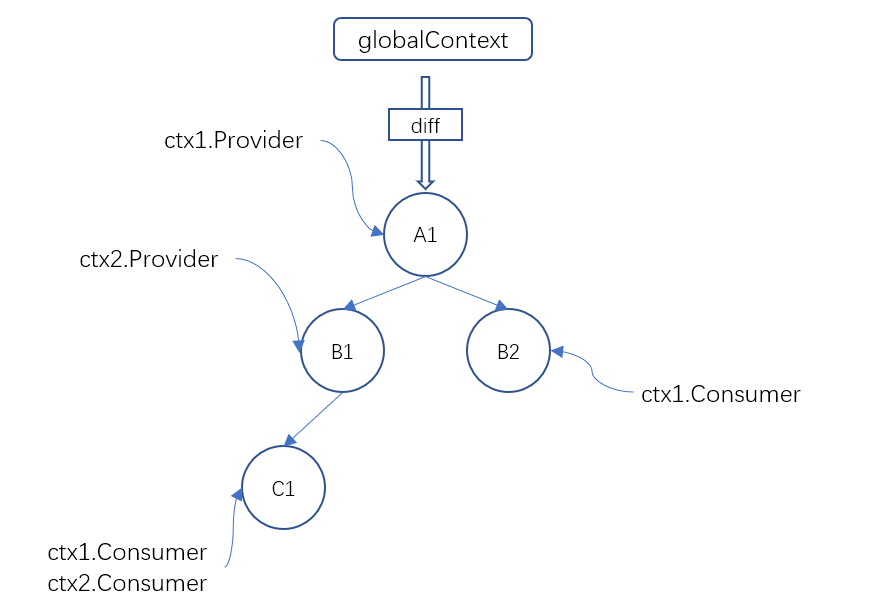

首先，在`diff` `A1`这个大节点（可以看成一个函数组件）的时候，发现其中使用了 `ctx1.Provider`，那么内部会干两件事情

- 浅拷贝一份`globalContext`
- 给浅拷贝的`globalContext`对象上添加一个`key`为 `ctx1.id`，`value`为`ctx1.Provider`的实例的项

接着，把浅拷贝的`globalContext`代替旧的`globalContext`，传递给 `B1` 和 `B2`

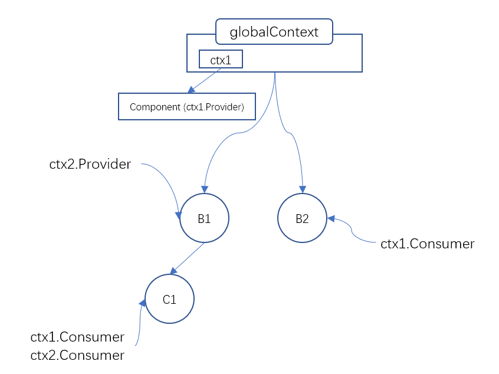

那么在`diff` `B1`这个大节点的时候，发现其中使用了 `ctx2.Provider`，那么内部会干两件事情

- 浅拷贝一份之前浅拷贝过的`globalContext`
- 给浅拷贝的`globalContext`对象上添加一个`key`为 `ctx2.id`，`value`为`ctx2.Provider`的实例的项

接着，把浅拷贝的`globalContext`代替旧的`globalContext`，传递给 `C1`。那么现在整课树中，`globalContext`指向如下所示

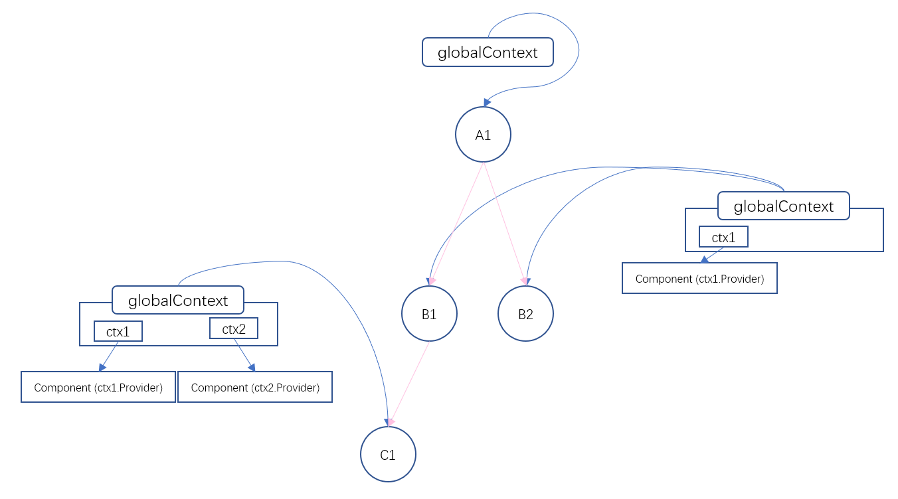

现在，每个子节点都可以从`globalContext`上获取到对应作用域下的内容

### 12.2.2	Provider实现

`Provider`因为是函数，所以内部会被`Component`代理实例化，所以可以在内部借助类组件的生命周期，自己实现一个发布订阅的机制

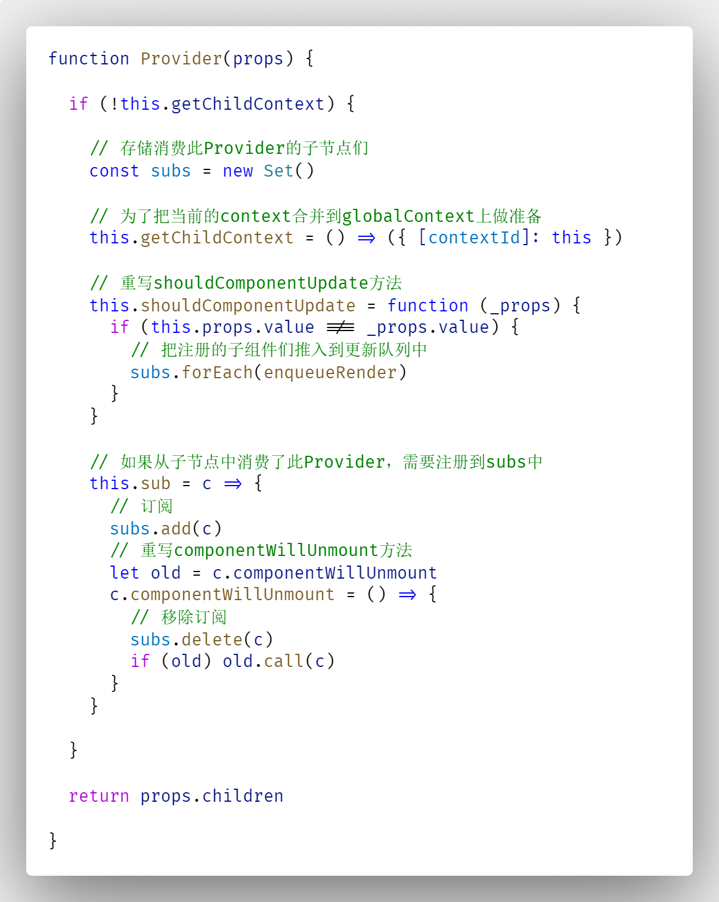

在实例化的时候，只需要判断当前节点上是否存在`getChildContext`，就可以知道是否需要重写`globalContext`

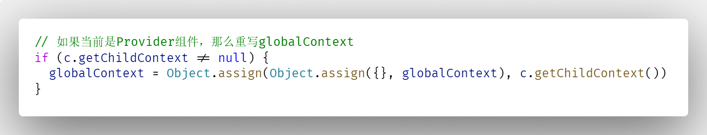

## 12.3	static contextType

`React`中有一种消费数据的写法，就是把要消费的`context`放置在类组件的静态属性`contextType`上，接着就能从`this.context`上访问数据


要实现这个效果，需要借助`globalContext`这个属性，从`globalContext`上获取对应`Provider`的实例

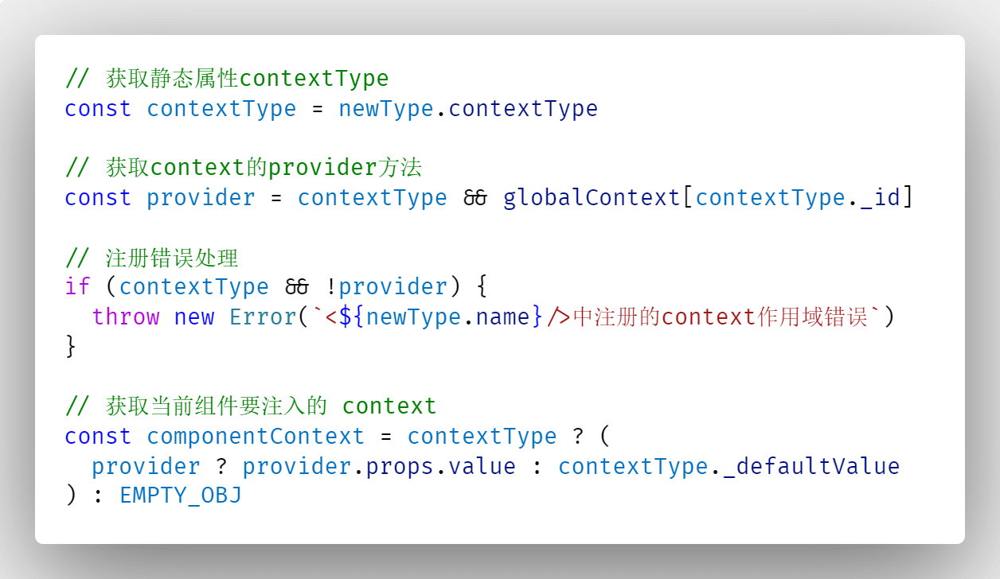

下一步，在组件初始化的时候，把使用到`static ContextType`的组件实例放到`Provider`的订阅表中去

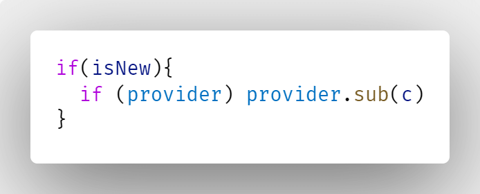

并把`context`存储到类的实例上去

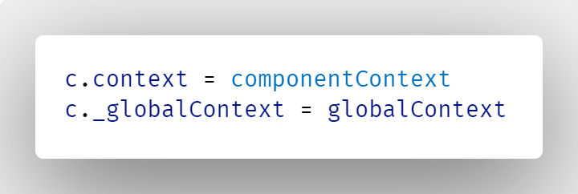

需要注意的是，因为`Set`散列表是无序的，所以可以给每个虚拟`dom`添加一个 `_depth` 属性，层级越深，`_depth`越大

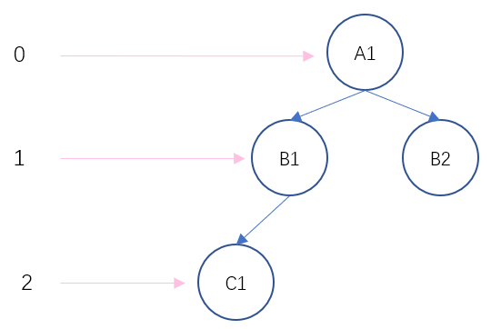

这样在执行`update`时，就可以先借助`_depth`排序，把层级最浅的虚拟`dom`排在前面，从而实现 [12.1](##12.1	rerenderQueue与_dirty)的效果

## 12.4	Consumer

`Consumer`的实现非常巧妙，两行代码就能搞定

- 给`Consumer`绑定一个静态属性`contextType`
- 因为`Consumer`是函数组件，并且绑定了一个`contextType`属性，那么这就意味着可以在`this.context`中访问到`provider`提供的数据，直接调用 `props.children(this.context)` 就能完成渲染

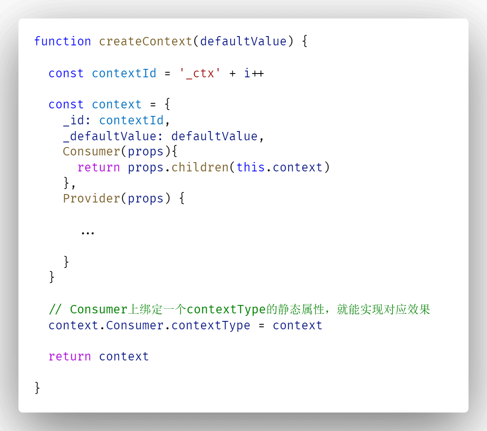


# 	13	hooks

> `hooks`的相关实现见 [/packages/13](https://github.com/bpuns/Preact-study/blob/master/packages/13)，可以使用 `$ npm run 13` 启动

## 13.1	准备工作

### 13.1.1	hooks基本原理

`hooks`为什么不能在循环，判断中使用，原因在于函数组件会像类组件中的`render`一样，重复执行。而`vue3`的`setup`，`solidJs`的函数组件，更像一个`constructor`，只会触发一次，因此它们不需要太在意`hooks`的顺序问题

`hooks`中的`useMemo`，`useCallback`，`useRef`等等还有缓存的作用，那么这些`hooks`怎么才能知道哪些东西需要使用缓存，哪些需要重新执行？在`Preact`中，它是这么实现的，首先，函数组件被`Component`代理，然后在实例化对象上，如果发现此函数组件中使用了`hooks`，那么就会在类实例上存储一个 `__hook`变量，具体结构如下

```js
{ 
  __hook: {
    // 存储hook的一些数据，方便下次判断与复用
    _list: [],
    // useEffect中用到，现在先不讲
    _pendingEffects: []
  } 
}
```

紧接着，定义一个变量 `hookIndex`，初始值为`0`

准备工作完成，开始执行函数组件，`hooks`执行的时候，都会从 `__hook._list[hookIndex]` 获取上一次的缓存（不同`hooks`存储的数据不同），然后内部，执行完成一个`hooks`后，`hookIndex`都会`+1`。因此，如果函数组件每次执行的时候，`hooks`的位置不固定，就会导致缓存利用失败

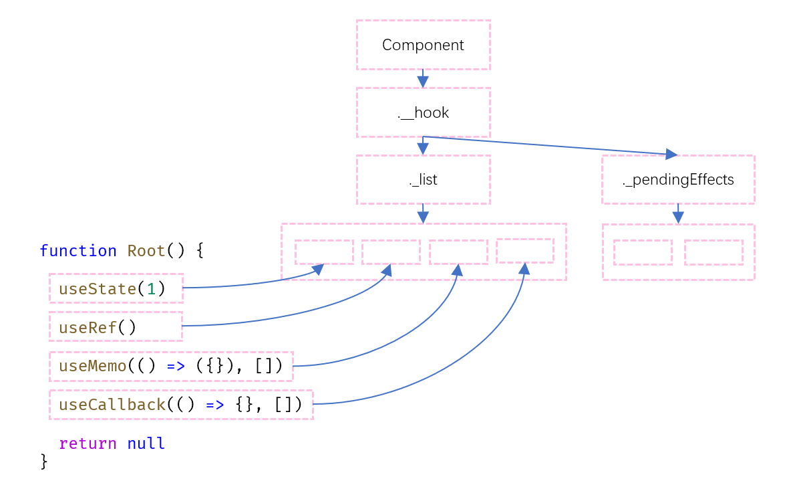

### 13.1.2	获取当前执行的组件实例

在函数组件的执行过程中，`hooks`需要从一个地方获取到当前函数组件的虚拟`dom`对象（从虚拟`dom`对象上可以获取到`Component`代理对象），在此对象上存放和写入一个数据。其实这很好实现，你从上面的实现中就可以看到，整个过程其实就是在和`diff`函数打交道，所以只需要在`diff`函数执行`render`获取虚拟`dom`之前，把当前的`newVNode`存储到一个地方就行了。因为`hooks`是可选功能，所以没必要在未使用`hooks`的时候存储`newVNode`

`Preact`是这么做的，它在全局存储了一个`options`的空对象，如果`import`了`hooks`的函数，就会在`options`上注册一个名为 `_render` 的函数，接着在`diff`函数中，调用`Component.render`前，调用`options._render`

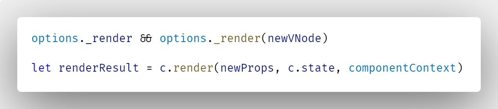

接着在`options._render`中保存实例

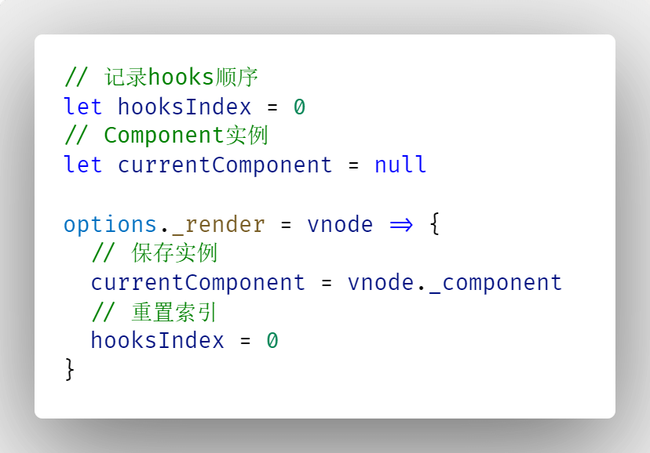

## 13.2	实现useMemo

准备工作都已经完成了，现在可以实现一个最简单的`hooks`来引出更多的知识点

`useMemo`的类型定义如下，第二个参数可以为了方便理解可以理解成一个“依赖”（实际上并不是依赖，只是一个标识符）

```ts
type Inputs = ReadonlyArray<unknown>;

function useMemo<T>(factory: () => T, inputs: Inputs | undefined): T;
```

`useMemo`内部会把接收到的`inputs`和泛型`T`存储起来，如果第二次执行的时候，发现`inputs`中的值和前一次相同，`factory`就不需要重复调用，直接把上一次的存储起来的`T`返回

准备一个`getHookState`，用来**获取**和**设置**当前函数组件实例上存储的数据


接着再准备一个用来判断新旧”依赖“是否一致的函数 `argsChanged`

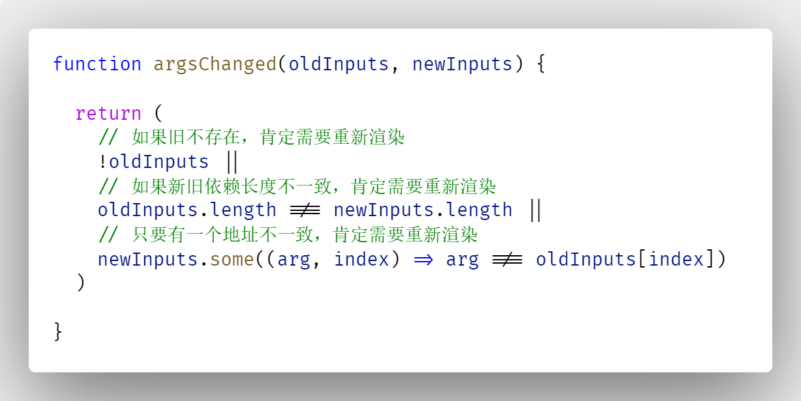

最后，`useMemo`的实现只需要借助这两个函数就能实现

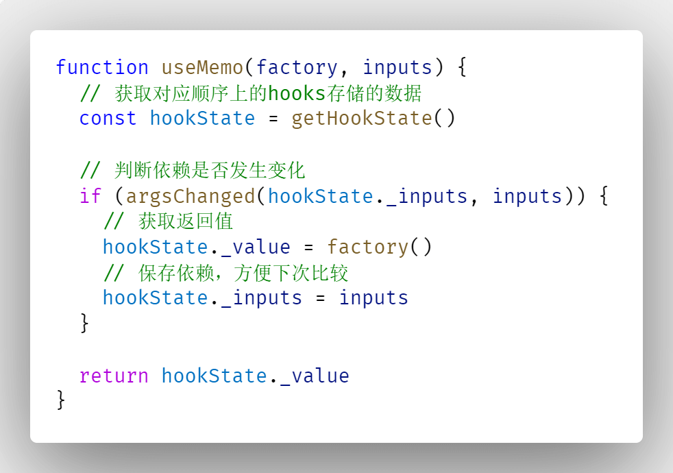


## 13.3	useCallback/useRef

在`Preact`中，`useCallback`/`useRef`全部都是用`useMemo`实现的

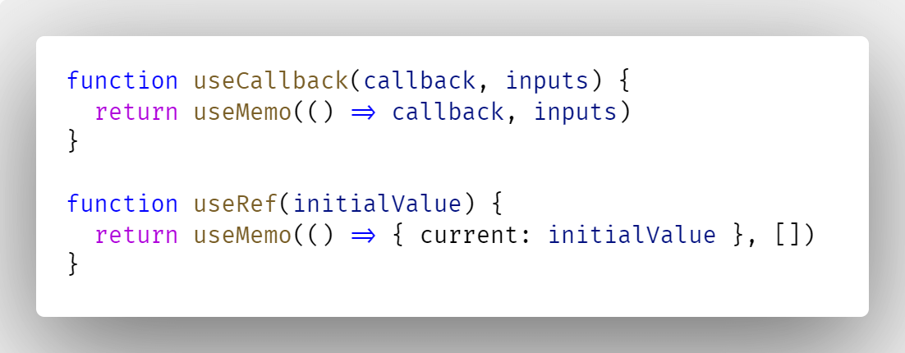

## 13.4	useReducer/useState

`useReducer`也能使用 `getHookState` 和  `argsChanged` 实现。需要在`hookState`上存储三个变量

- **_reducer：** 存储`reducer`函数
- **_value：** 存储`useReducer`的返回值，
- **_component：** 存储当前`useReducer`所在的组件实例，方便在触发`dispatch`后直接调用`setState`更新

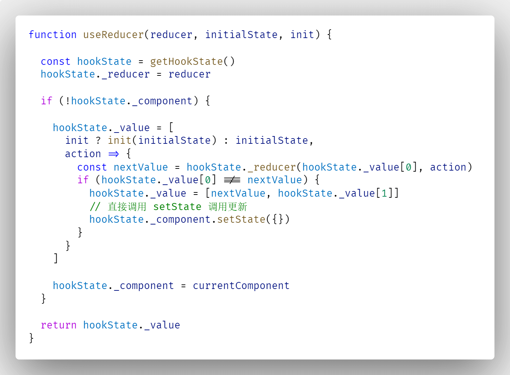

`useState`使用 `useReducer` 就可以实现

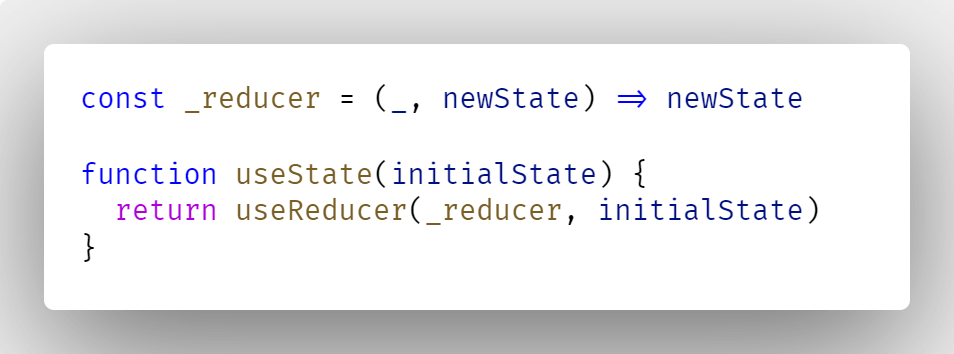

## 13.5	memo

### 13.5.1	PureComponent实现

写到这里的时候，突然想起来`PureComponent`忘记写了，`PureComponent`只需继承`Component`，并添加一个`shouldComponentUpdate`的方法就能实现，如下

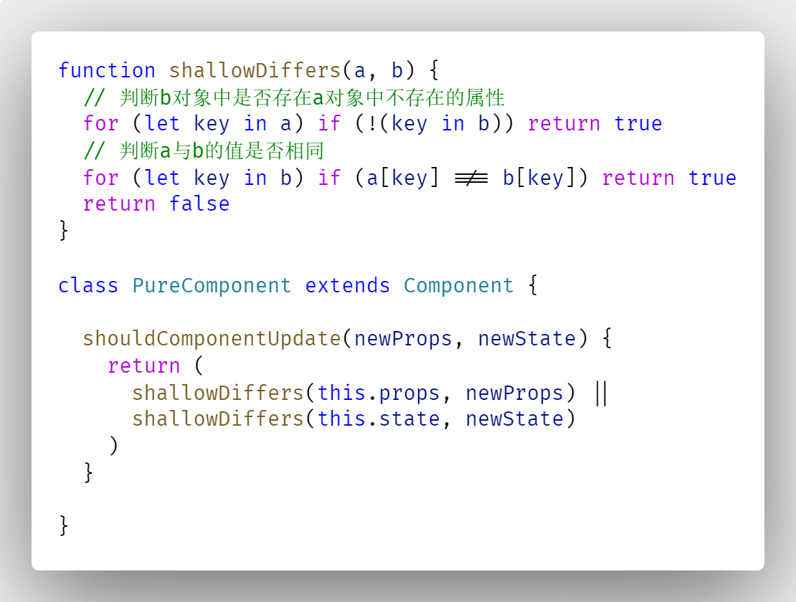

### 13.5.2	memo实现

`memo`可以借助`PureComponent`实现，如下


## 13.6	useContext

因为在调用`hooks`的时候，可以获取到当前的组件实例，也就是说可以获取到当前实例上的`globalContext`，那只需要在`useContext`中完成两件事情，第一步是取出`Provider`组件的实例，第二步是订阅组件

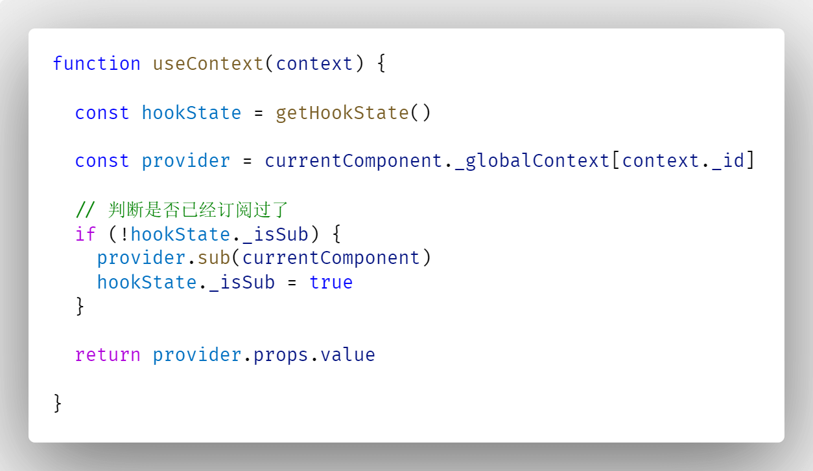


## 13.7	useLayoutEffect

### 13.7.1	执行流程

前面的`hooks`的实现相对简单，`useLayoutEffect`会稍微麻烦，因为`useLayoutEffect`有充当生命周期的作用，它的第一个参数（`callback`）的返回值是一个函数，它会根据“依赖”的变化，在下一次`update`前执行，如果没有”依赖"就会在组件卸载时执行

如下图所示，注意”类似“两个字，因为性质和生命周期并不完全相同

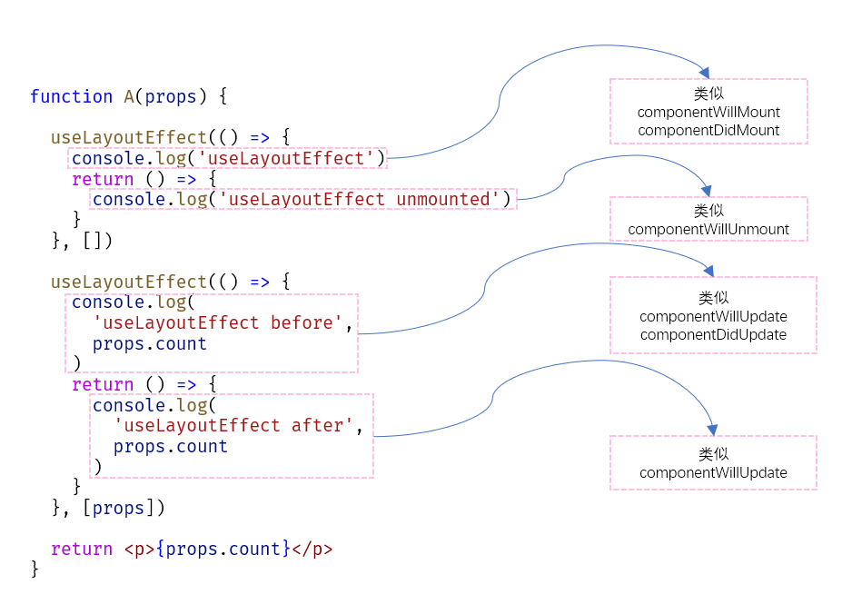

当页面初始化的时候，控制台打印如下

```
useLayoutEffect
useLayoutEffect before 1
```

当`props.a + 1`的时候打印如下

```
useLayoutEffect after 1
useLayoutEffect before 2
```

当A组件卸载的时候打印如下

```
useLayoutEffect unmounted
useLayoutEffect after 2
```

### 13.7.2	update实现

```ts
function useLayoutEffect(effect: EffectCallback, inputs?: Inputs): void;
```

 第一步，判断 `inputs` 是否发生变化，如果发生变化在的 `hookState` 上会存储三个值

```
_effect    存储第一个回调，这个回调不会立马触发
_inputs    存储第二个依赖
_cleanup   存储调用_effect后的返回值
```

接着把`hookState`存储在 `currentComponent._renderCallbacks` 上

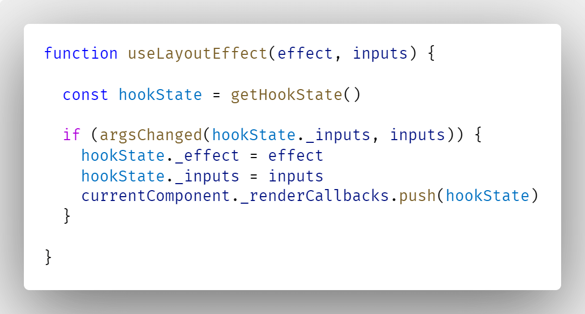

因为`_renderCallbacks`默认存储的是方法，但是`hookState`是对象。所以在`commitRoot`中一定会报错，因此需要在`commitRoot`执行前，把`hookState`和其它方法筛选出来，可以像获取组件实例一样，在`options`上注入一个方法

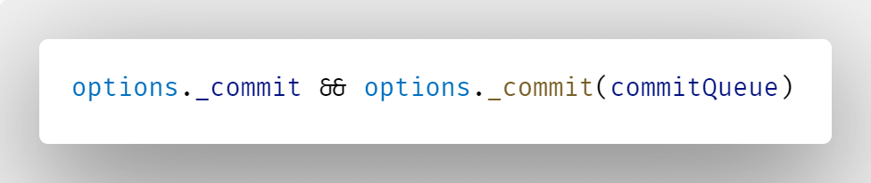

此方法需要对`_renderCallbacks`进行过滤，把`hookState`取出来，剩下的重新写入到 `_renderCallbacks` 中。取出来的`hookState`传入`invokeEffect`函数中，这个函数只干一件事情就是执行`_effect`函数，并把返回值赋值给`_cleanup`

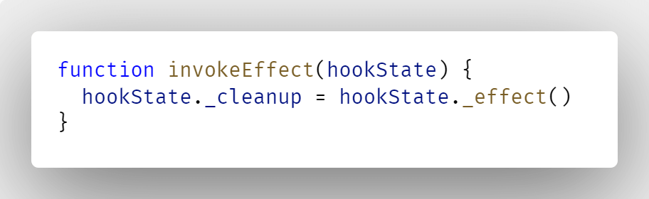

那么这个`_cleanup`什么时候执行呢？它在`invokeEffect`之前执行，那么可以再定义一个函数，名为`invokeCleanup`，这个函数的作用就是执行`_cleanup`，执行完成之后，清除`_cleanup`

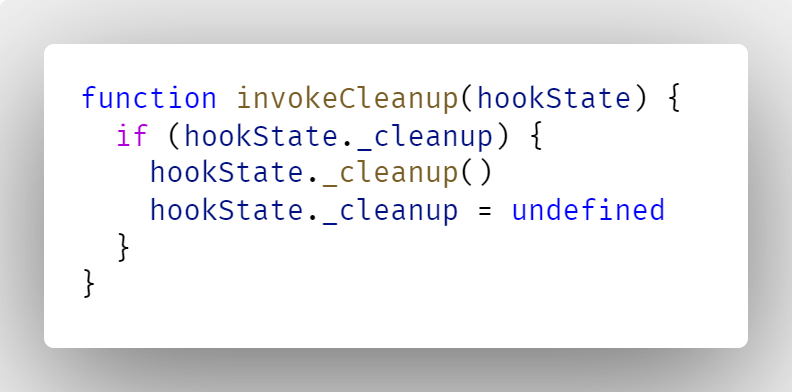

那么`_commit`的完整代码如下

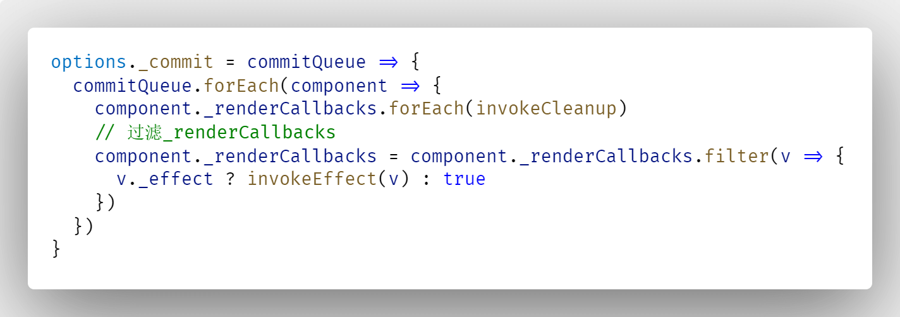

### 13.7.3	unmount实现

到到现在为止，`useLayoutEffect`的大部分功能都已经完成，只缺少了一个组件卸载的时候调用的方法

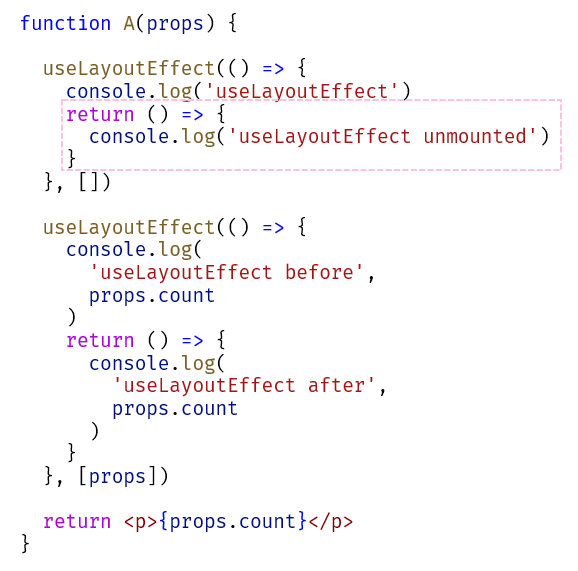

次函数其实在初始化的时候，已经存储到了`_clearnUp`中了，之所以没有被触发，是因为第二次更新的时候，“依赖”没有发生变化，所以没有把`hookState`存储到`_renderCallbacks`中，所以需要在组件卸载前，把存储起来的`_clearnUp`全部执行。只需要给`options`注入一个方法，并在`unmount`函数中执行

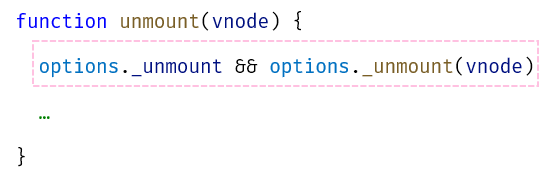

接着，判断是否存储了`_clearnUp`，如果存储了，执行便是

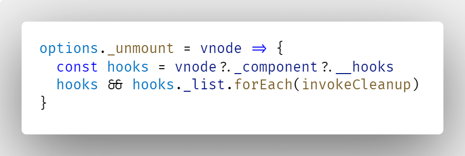

## 13.8	useEffect

在`Preact`中，`useEffect`的表现形式与`React`不同，`Preact`在组件卸载的时候，`useEffect` 会比`useLayoutEffect` 先触发，所以下面的代码不以`Preact`官方为准，自己实现

`useEffect`的实现与`useLayoutEffect`类似，只不过不把`hookState`存储在`_renderCallbacks`中，而是`_pendingEffects`中，这里需要添加一个属性`_isUseEffect`属性用于和`useLayoutEffect`区分

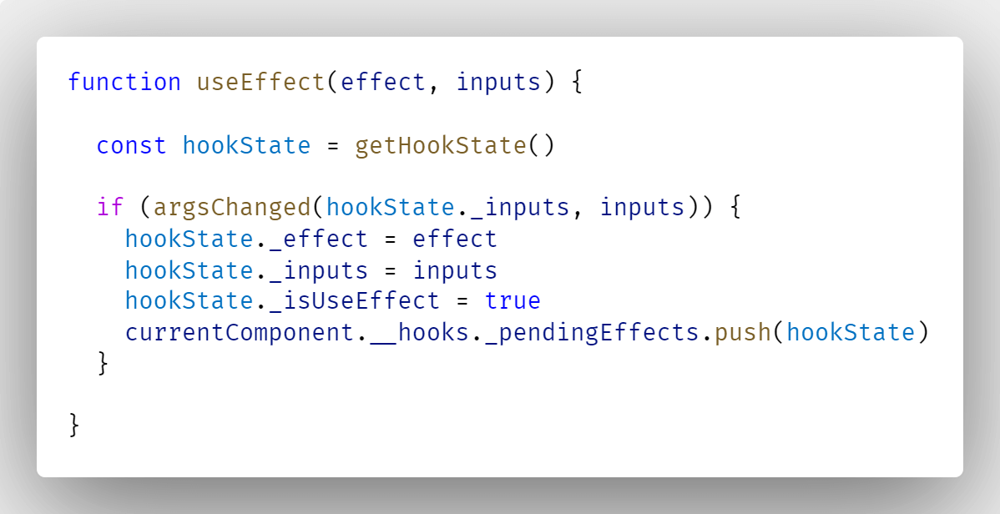

接着，给`options`上添加一个`_diffed`方法，用于执行`_pendingEffects`上的方法，此方法在所有子节点完成后触发

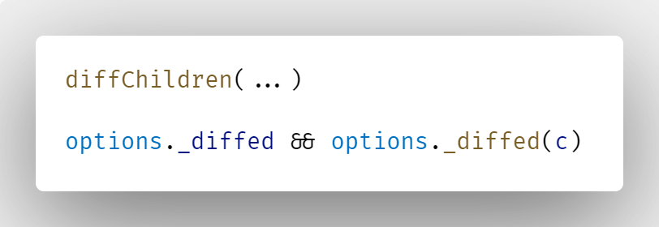

因为`useEffect`不会阻塞页面渲染，所以可以做一个类似`setState`的更新队列，把所有`useEffect`放置到下一次宏任务中执行所有

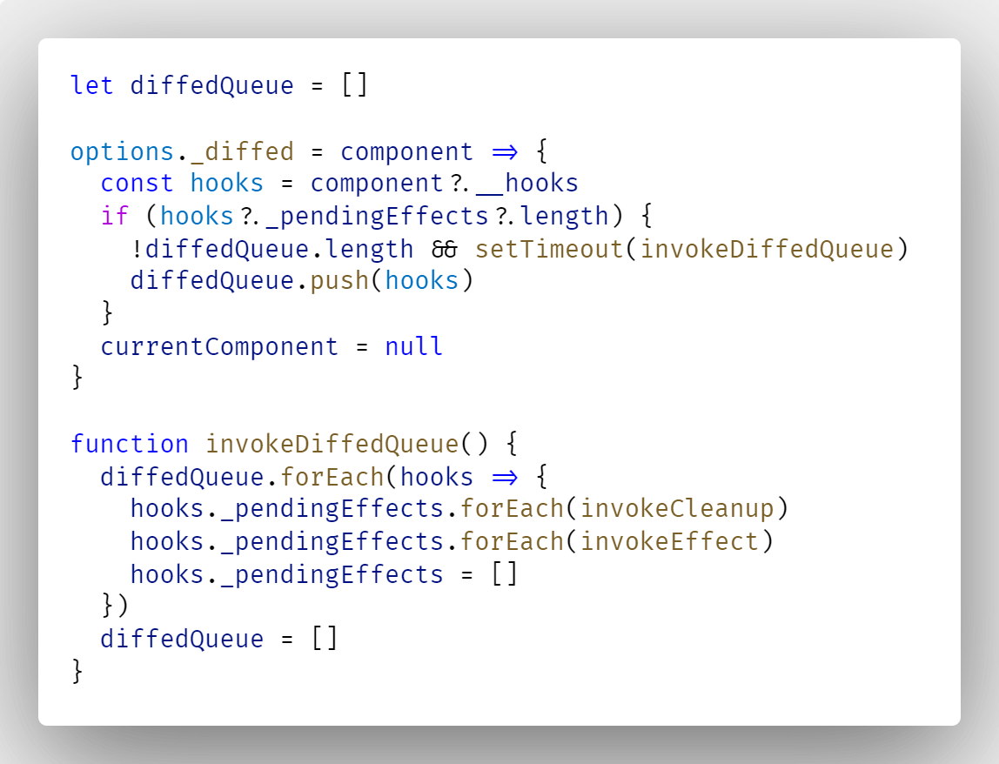

那么卸载同理，准备一个`options._unmounted`方法，执行所有 `clearnUp`方法

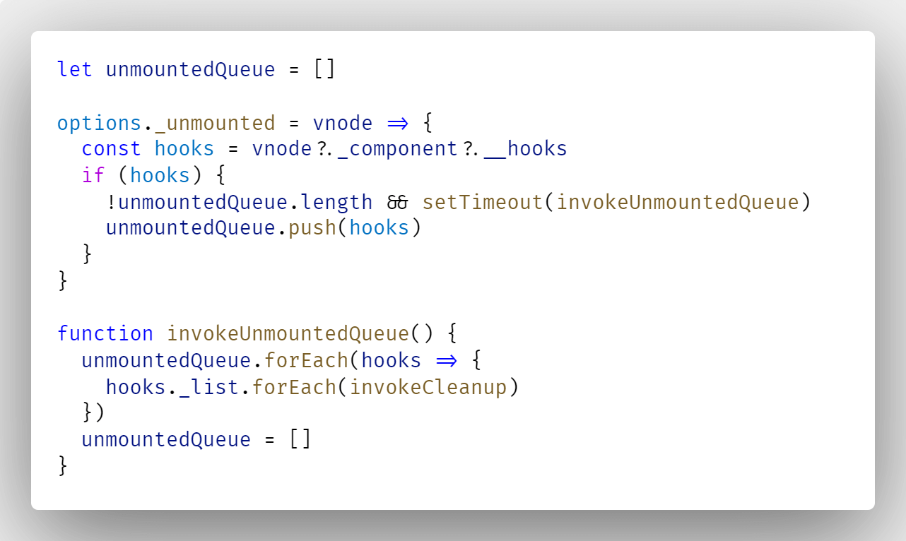

到现在为止其实就已经实现大半了，只不过会出现一个问题，`useEffect`会比`useLayoutEffect`先执行，并且在`useEffect`中还能访问到页面上的`dom`，这是因为`options._unmounted`方法没有生效，所有的`_cleanUp`方法在 `options._unmount`中全部执行完了。为了解决这个问题， 就要运用到 `_isUseEffect` 这个标识，修改`options._unmount`方法

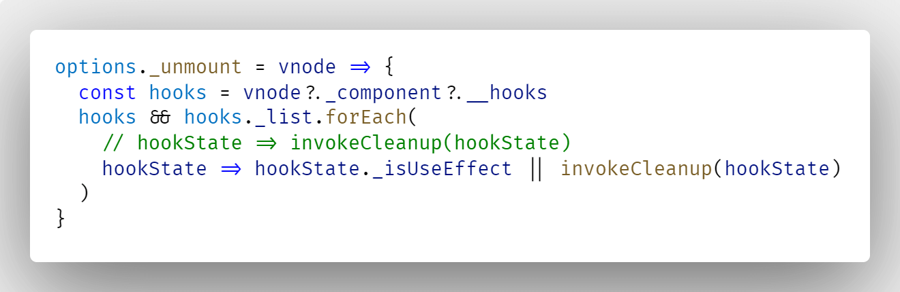

# 14	concurrent mode

## 14.1	递归存在的问题

在`diff`中使用递归的方式会出现一个问题，就是在`diff`的整个过程中，页面是卡死的状态，用户没法操作页面，就会造成不好的用户体验。以60帧的显示器为例，渲染一帧需要16.6ms，如果页面中正在展示动画，如果一帧的渲染时间超过16.6ms，就会出现卡顿，一般这种情况都是在某一时刻，任务执行时间太长，理想状态下，浏览器以下面的方式进行执行任务

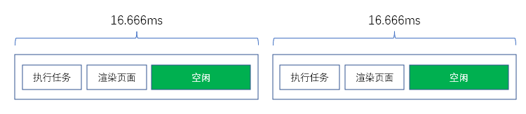

但是如果`js`执行时间过长，就会出现下面的情况

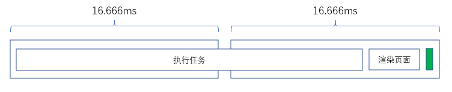

那么有没有这么一种`api`，能够告知`js`，一帧还有多少空闲时间，如果空闲时间不够，直接暂停js程序，等到下一帧再运行，以此反复，直到任务执行完成？`requestIdleCallback`这个`api`就进入了`React`的视野了，这个`api`能够告知开发者，浏览器是否在空闲状态，由于这个`api`还在实验阶段，于是`React`官方自己实现了一个

## 14.2	concurrent mode基本原理

获取空闲时间的问题解决了，那么一份空闲时间内要执行多少任务？对于这个问题，`React`官方推出了一种新的用来描述页面结构的数据结构，名为`fiber`，可以把每个`fiber`都看成一个最小的执行单元，不可再分割，大致结构如下

```js
{
	// 标识当前是什么节点
  tag: null,
  // 当前fiber对应页面中的真实dom地址
  stateNode: null,
  // 虚拟dom的type值
  type: null,
  // 虚拟dom的props值
  props: null,

  // 当前节点的父节点
  return: null,
  // 当前节点的兄弟节点
  sibling: null,
  // 当前节点的第一个子节点
  child: null,
  
  // 副作用指针
  firstEffect: null,
  nextEffect: null,
  lastEffect: null,
    
}
```

`fiber`其实就是虚拟`dom`的另外一种描述形式，下图的左边是页面中`dom`结构的树型描述，右边是`fiber`的基本结构描述

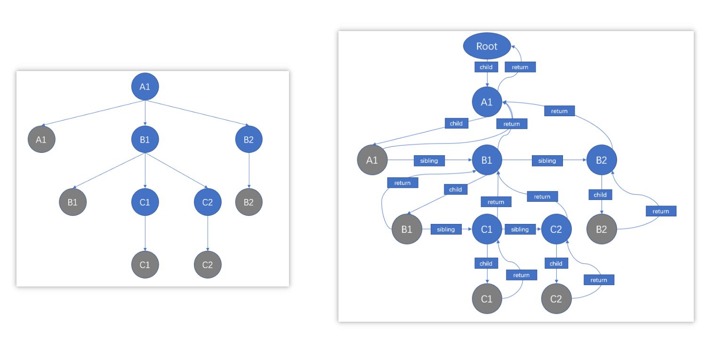

`fiber`并不是凭空产生的，并且也不会在预编译时出现，而是运行时。这意味着`fiber`还会在运行时浪费一部分的性能，从虚拟`dom`转化成`fiber`。但是带来的好处是，这个单元足够的小，因此不会执行一个小单元就把当前帧的空闲时间占满（如果某一个单元执行时间过长，依然会出现掉帧），借助`requestIdleCallback`这个`api`就能实现如下效果

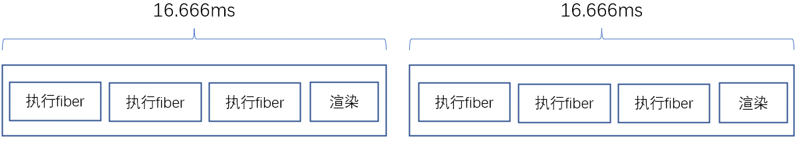

当处理完成一个`fiber`之后，`React`会判断当前的`fiber`是否需要更新，然后挂载在父节点上，处理父节点的时候判断子节点或自己是否需要更新，如果需要再挂载到父父节点上，以此类推，等所有`fiber`全部处理完成之后，所有需要更新的`fiber`都会通过链表串起来，然后做一个`while`循环，一次性更新

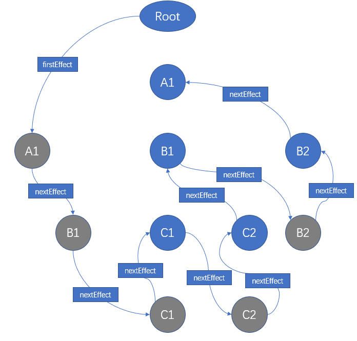


## 14.3	为什么不看好concurrent mode

尤雨溪曾经这么评价`React`

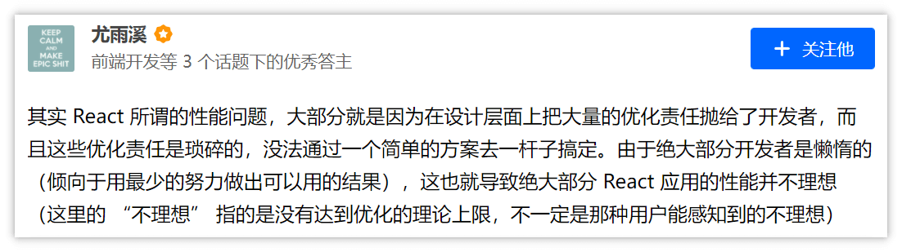

`concurrent mode`本质上并没有带来性能上的提升，并且可能还会带来性能劣化。而且还会带来新的概念，开发者增加门槛，附带增加了一道面试题。`github`上有人向尤雨溪提问，为什么vue3要移除时间切片？尤雨溪也进行了[答复](https://github.com/vuejs/rfcs/issues/89#issuecomment-546988615)，大致意思就是说，`Fiber`架构并不是为了解决过度渲染的问题而出现的，而是为了解决一个大任务渲染时间过长而存在，`Preact`的开发者对尤雨溪的回答也进行了认同，[传送门](https://github.com/vuejs/rfcs/issues/89#issuecomment-547128896)

解决过渡渲染的问题`Vue`已经帮助开发者做好了，因此，就算交给`js`基础非常差的人，写出来的应用性能也不会差到哪里去。而`React`中的优化交给开发者，而大部分的开发者其实根本就不会去做优化，俗称能跑就行，对于这类开发者而言，`fiber`反而再次减低了性能，因此我并不是很看好`concurrent mode`

当然，虽然不看好，但是学还是得学的，`Vue3`都来了，`React18`还会远吗

