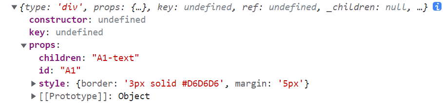
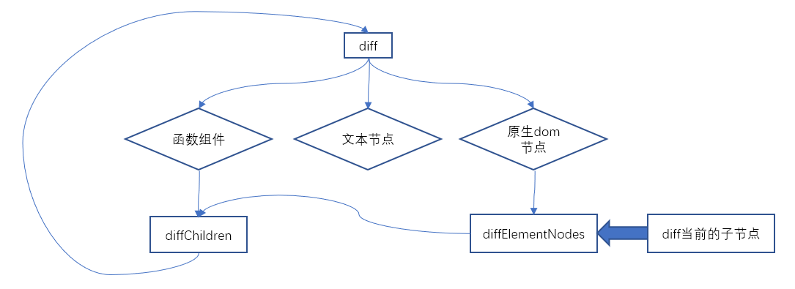
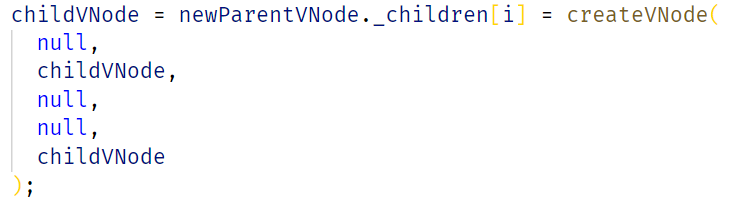
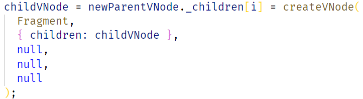
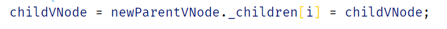
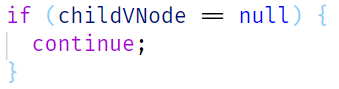
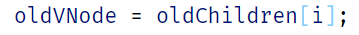

# 初始化

比如，现在的虚拟dom结构是
```ts
h(
  'div', { id: 'A1', style },
  'A1-text'
)
```



在初始渲染的时候，`preact`会在传入的虚拟`dom`中包裹一层 `Fragment`，并且把子节点包裹一层

```ts
createElement(Fragment, null, [vnode])
```

这样就会生成一个新的虚拟`dom`


接着，直接开始`diff`，`diff`可以分为3种情况

- 当前虚拟`dom`节点函数组件
- 当前虚拟`dom`节点是文本节点（因为如果是文本的话，只是一个字符串，所以在`diff`的时候，需要转化）
- 当前虚拟`dom`节点是原生节点（`div`，`span`）

主要参与的函数有三个

- diff：判断当前是什么节点，如果当前是函数节点的话，执行一系列操作，如果是`dom`节点的话，调用`diffElementNodes`
- diffElementNodes：处理props等一些列操作，如果有子节点，就调用 `diffChildren` 
- `diffChildren`：处理子节点，diff算法核心




# diffChildren

在调用这个函数的时候，会传入当前虚拟dom的子节点，会把当前子节点转化为一个 数组

```ts
Array.isArray(renderResult) ? renderResult : [renderResult]
```

## 1.1	

然后在函数内部直接`for`循环，索引`i`，在具体复用节点之前，还经过了一个判断

1. 判断当前子节点是否是 `null`，`undefined`，或者`boolean`，如果是的话，父节点的`_children[i]`设置为null
2. 如果当前节点是 string，number，大整型的话，那么创建一个新的虚拟dom



3. 如果当前节点是数组的话，那么就再包裹一层`Fragment`，方便之后比较，不用特殊处理



4. 如果当前虚拟`dom`节点的 `_depth` 大于 `0` 的话，说明这个节点以前使用过，那么克隆一份


5. 如果上面的情况都没遇到过，直接赋值到对应的 _children 中



## 1.2	

判断 当前节点是否为 `null`，如果为`null`，`continue`



接着，从旧的父节点上寻找可以复用的虚拟`dom`节点，首先，直接取对应`i`的元素



如果`oldNode`和`childVNode` `key`，`type`一样的话，说明找到了

如果不一样，就需要循环整个旧的`children`，找到了，没找到都把当前的节点传入 diif 函数，继续比较